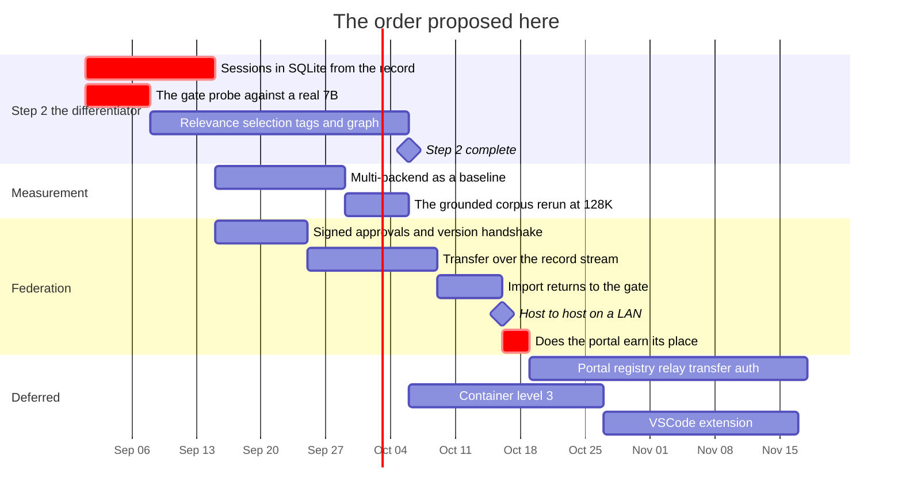
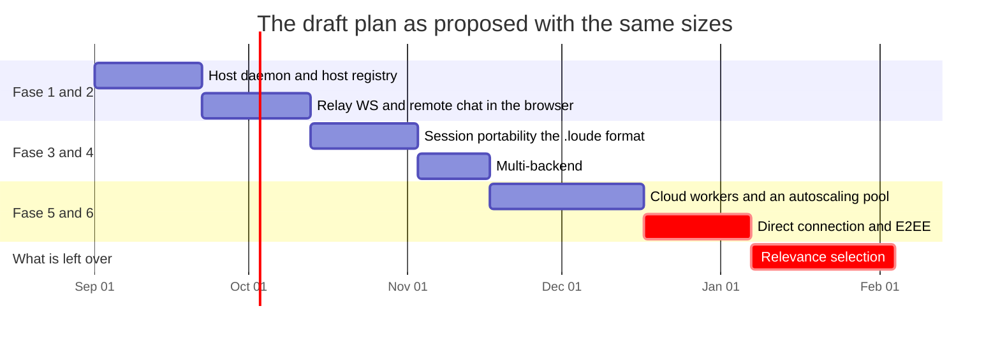

# Roadmap — revision 2026-08-31

> **Superseded by [`ROADMAP/2026-09-01/`](../2026-09-01/).** Nothing here landed before
> it was superseded, so nothing is struck through — what changed was the premise and two
> measured facts. Kept as written.

**What this is:** the order of work as it stands on this date, and what blocks
what. Not a decision and not a description of the tree — for *what is true
today* read [`loude-design.md`](../../loude-design.md), and for *why* read the
dated file in [`RECORD/`](../../RECORD/) each item links to.

This revision exists because a federated architecture was proposed
(*"Loude — Sistema Federado de Agentes"*, v0.1-draft, 2026-08-31) and the
argument about it —
[`RECORD/2026-08-31.the-portal-and-the-gate.completed.md`](../../RECORD/2026-08-31.the-portal-and-the-gate.completed.md)
— ended in an ordering claim that had nowhere to live. This is that place.

## The thesis, in one paragraph

**Relevance selection is the only unbuilt piece of step 2, and step 2 is the
whole point of the project.** Everything federated is downstream of a session
store that does not exist yet, and the security-relevant half of it (signed
approvals) is a phase-two requirement rather than an optimization. So: finish
the differentiator, pay the blocker, and let host-to-host transfer prove itself
on a LAN before anyone operates a portal.

## The order

This is the engine track. The surface — the four places a person actually
reaches this from, and what each is missing — is
[`surface.md`](surface.md), sequenced on its own because it is a chain where
this one is a fan. Items 1 and 4 below are shared between the two, which is most
of what makes the surface affordable at all.

| # | Item | Blocked on | Argued in |
| --- | --- | --- | --- |
| 1 | **Sessions in SQLite, derived from the record** | nothing | [`state-of-play`](../../RECORD/2026-08-30.state-of-play.completed.md), [design §Persistence](../../loude-design.md) · spec'd in [`session-store.md`](session-store.md) |
| 2 | ~~**The gate probe against a real model**~~ | a machine | [`the-gate-probe`](../../RECORD/2026-08-31.the-gate-probe.completed.md) — completed |
| 3 | **Relevance selection** — `tree-sitter` tags over a reference graph | nothing (unblocked since tools landed) | [`aider-repo-map`](../../RECORD/2026-08-27.aider-repo-map.completed.md), [`the-repo-map`](../../RECORD/2026-08-31.the-repo-map.completed.md) |
| 4 | **Multi-backend as measurement** | nothing | [`the-portal-and-the-gate`](../../RECORD/2026-08-31.the-portal-and-the-gate.completed.md) §Where it is right |
| 5 | **Federation without a portal** | 1, and signed approvals | [`federation.md`](federation.md) |
| — | Container level 3 · VSCode extension | the core being stable | [design §Suggested work order](../../loude-design.md) · sequenced in [`surface.md`](surface.md) |

[`gantt.html`](gantt.html) is every chart in this revision on one standalone
page, SVG inlined, no network needed — generated from the markdown in this
directory by [`scripts/render-gantt.mjs`](../../scripts/render-gantt.mjs), so
edit the markdown and re-run it rather than editing the page.

**The bars are sizes, not commitments.** They assume one person working evenings,
they start from an arbitrary 1 September, and the only thing in them worth
trusting is the *shape*: what runs in parallel, what waits, and where the
decision points fall. Correct the durations to your own calendar — that is what
a revision is for.

## What actually blocks what

Three real dependencies, and everything else in the chart is preference:

- **The session store blocks all of federation.** There is no session to transfer
  while `serve` loses the conversation on restart. It does not block relevance
  selection or the gate probe, which is why those two start first and in parallel.
- **Signed approvals block the first off-loopback bind**, not the portal. The
  moment a host is reachable by anything but a browser on the same machine,
  `approve_task` is reachable too — and an approval grants read, write and
  `run_command`. This is the one item whose *order* is a safety property rather
  than a preference.
- **Relevance selection blocks nothing and is blocked by nothing.** It is pure
  differentiator, it has a recorded baseline waiting to be beaten (path order,
  6 327 tokens for this repository's whole outline, 77% of an 8K window), and it
  is the item most likely to be crowded out by work that feels more urgent. That
  is precisely why it is on the critical path here and nowhere else.

## What the proposed order costs

The draft plan's six phases in the same units, so the two are comparable:

Two readings, and both are in the shape rather than the dates:

1. **The differentiator lands last**, after five phases of infrastructure that
   every agent product already has. A relay is not what this project is for.
2. **E2EE sits in phase 6, behind cloud workers.** Which means the window between
   *a host is reachable through a third party* and *approvals are unforgeable* is
   the widest span on the chart. Read the two charts side by side and that gap is
   the entire argument of
   [`the-portal-and-the-gate`](../../RECORD/2026-08-31.the-portal-and-the-gate.completed.md)
   §3, drawn rather than written.

## When this revision is superseded

A new `ROADMAP/<date>/` directory, not an edit to this one. Items that land get
struck through here with a link to the record that closed them, so a later reader
can see what this revision got right and what it missed. The misses are the
useful part; a roadmap edited to look prescient afterwards is worth nothing.
