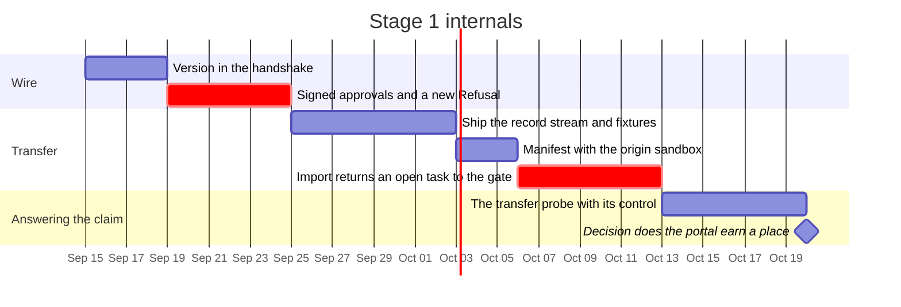

# Federation, in the order it can safely be built

Sequencing only. The argument for every change below is in
[`RECORD/2026-08-31.the-portal-and-the-gate.completed.md`](../../RECORD/2026-08-31.the-portal-and-the-gate.completed.md)
and is deliberately not repeated here.

## Kept from the draft plan

Outbound-only connections, host sovereignty, transfer as an explicit act, the
cloud worker as level 3 under another name. None of that is in question.

## Stage 0 — the prerequisite

[`session-store.md`](session-store.md). There is nothing to federate until a
session survives a restart.

## Stage 1 — host to host, on a LAN, with no portal at all

Four things have to be true before a host is reachable by anything other than a
browser on the same machine:

1. **The wire says its version.** Host and client are one artifact today
   (`rust-embed`); the moment they are not, a handshake has to carry
   protocol version and record format, and the host refuses a client it cannot
   parse — out loud, as a `Refusal`, not by misreading it.
2. **Approvals are signed with a key no relay holds**, and an unsigned approval
   is refused. The verdict records who approved, the same way it already records
   who enforced. This is the item whose ordering is a safety property.
3. **Transfer ships the record stream**, not a snapshot. The destination folds it
   with the same `SessionView` the live server and the static mirror both use.
4. **An imported task that is not `Closed` returns to the gate** on the
   destination, re-validated against the destination's `luu.toml`, in the
   destination's paths. The manifest carries the origin's resolved sandbox so
   the person approving can see the difference. A plan that does not resolve
   imports as a refused proposal.

**Exit criterion.** Two machines on a LAN, a session moved between them, an open
task re-approved on arrival, and the transfer probe run. If host-to-host does not
earn its place here, the portal cannot inherit a justification it never had.

## The transfer probe, written before it is run

The claim *a session moves between backends without loss of context* is the same
shape as the fold's, which was believed and was false until measured. So, the
fold probe's discipline:

- **The control is the same session continued on the same model on both hosts.**
  Without it, *the history moved* and *the destination model is worse* are one
  reading.
- Separate **loss from the move** from **loss already taken at the origin** —
  eviction and folding are decisions made under the origin's window, and the
  tombstones can say which turns left.
- Report every count with the `Counter` that produced it. A history measured with
  one tokenizer and continued under another has a budget measured with two rulers,
  and nothing else in the system would say so.

## Stage 2 — the portal, only if stage 1 earned it

Registry, relay, auth, transfer service — in the draft's own shape, with three
corrections:

- The session index holds no turn content. `title` as *the first 50 chars of the
  initial prompt* is turn content; a user-set name or an opaque id is not.
- The transfer service moves a blob it cannot read, or it does not move evidence
  at all.
- The relay stays transparent, and transparency stops being a claim the host has
  to trust the moment approvals are signed.

## Still open

Push or pull; whether a session may exist on two hosts at once (with an
append-only stream it is a fork, and forbidding it is smaller than naming it);
whether evidence should leave the machine in any form; reading the context window
from the backend, which transfer makes sharper because the window is a property
of the destination.
