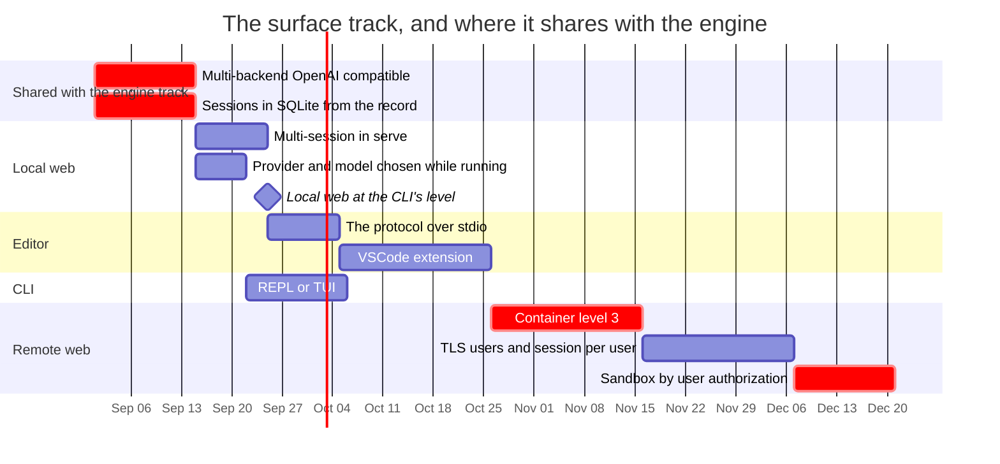

# The surface, in the order that unblocks the most at once

Sequencing only, for the half of the work the other files in this revision do not
cover: the places a person actually uses this. The engine track asks *does the
context strategy help*; this one asks *can anyone reach it*.

**This item has no record behind it**, which is worth saying out loud rather than
leaving as a missing link. `luu-design.md` §Suggested work order has the
container at step 5 and the VSCode extension at step 6 and nothing else about a
user-facing surface; the four environments below have never been argued anywhere.
Read this as ordering, not as a decision that was reached — and if one of the
open questions at the end gets answered, it gets answered in a record first.

## The four environments

Distance is a judgement. What sits under each judgement is checked against the
tree at `c11057e`.

| Target | Distance | What decides it |
| --- | --- | --- |
| **CLI**, at the level of opencode | medium | the engine is there; an interactive session and a second provider are not |
| **VSCode extension** | far, but cheap | zero code written; the protocol exists, its transport does not |
| **Web, local** | short | it exists and works — as a single-session *debugging* client |
| **Web, remote and secured** | very far | level 3 is unstarted, and the auth half is undesigned |

## What each one is missing

Short, and each line is a thing that is absent from the tree rather than an
argument for adding it.

**CLI.** `luu` has five subcommands — `chat`, `serve`, `tools`, `map`, `export`.
`chat` is one-shot (argument, stdin, or `--script`); there is no REPL. `BackendKind`
is `Mock` and `Ollama` ([`lib.rs:387`](../../crates/luu/src/lib.rs#L387)) with no
OpenAI-compatible endpoint, so no LM Studio, `llama-server` or vLLM. Model, URL
and window are flags. `luu.toml` is `[sandbox]` and nothing else — no provider
profiles, no user config. `--record` writes a session and nothing reads one back,
so there is no resume. Whether the CLI should grow a gate at all is open in
[`luu-design.md`](../../luu-design.md) §Open questions.

**VSCode extension.** Not started, deliberately last. The half that is done is
elsewhere: protocol v3 is a versioned, transport-agnostic JSON enum and
`agent-core` knows nothing about the CLI or the browser. What is missing is the
transport — [`protocol.rs:3`](../../crates/agent-core/src/protocol.rs#L3) says
these types travel "over stdio (the VSCode bridge)", and stdio appears in the
tree only in that sentence and four others like it. The only implemented
transport is `/ws`.

**Web, local.** The closest of the four, with a catch: it was built as an
instrument, not a product. The panels outweigh the chat because the UI exists to
produce the numbers one context strategy is compared to another with. To be the
CLI's equivalent it needs multi-session — `serve` holds one `Mutex<Session>` and
one `Mutex<SessionView>`, and refuses a second turn with *"one at a time until
sessions exist"* ([`serve.rs:790`](../../crates/luu/src/serve.rs#L790)) —
persistence, and provider/model/window chosen while running rather than at
startup.

**Web, remote.** Not started. Since [`federation.md`](federation.md) the transport
half is at least staged: version handshake, signed approvals, transfer over the
record stream. What is still unwritten is the other half — TLS, users, a session
per user, and how an authenticated user composes with an approved plan, which are
two different permissions that nothing has yet described together.
[`luu-design.md:427`](../../luu-design.md#L427) is the whole of it today:
loopback by default, no auth, a bearer token when bound elsewhere.

## The order

The criterion is which item unblocks the most targets at once, not which looks
most like a finished product.

| # | Item | Unblocks | Shared with |
| --- | --- | --- | --- |
| 1 | **OpenAI-compatible backend** | CLI and remote web at once — one implementation behind the existing `Backend` trait and LM Studio, `llama-server`, vLLM and remote hosts all arrive | engine track #4 |
| 2 | **Sessions in SQLite, and multi-session in `serve`** | resume in the CLI, a usable local web, and any multi-user web | engine track #1, spec'd in [`session-store.md`](session-store.md) |
| 3 | **The protocol over stdio** | the VSCode extension, without writing the extension yet | — |
| 4 | **REPL/TUI in the CLI** | the CLI alone | — |
| 5 | **Level 3 before auth** | the remote web | engine track, deferred row |

Item 4 is the one that most resembles the stated target and unblocks the least,
which is why it is fourth. Item 5 is an ordering claim of the same kind as signed
approvals in [`federation.md`](federation.md): auth over an unisolated
`run_command` is a door with a sign on it, so the container is not a later
hardening step but the precondition for the target it serves.

## What blocks what

Two things came out of drawing it, and they are the reason this file exists
rather than a row in the README.

- **The surface has almost no degrees of freedom.** It is a chain — providers →
  persistence → multi-session → stdio → extension → container → auth — where the
  engine track has three items that start in parallel. Nearly every ordering
  question on this side answers itself; the interesting choices are all on the
  other one.
- **The remote web's bar is the least trustworthy on the page.** Everything else
  above it is sizing work whose shape is known; this one is gated on a container
  that is unstarted and an auth design that is unwritten, so its duration is a
  guess about a guess. It is last on the chart because it is last in the chain,
  not because a date was chosen for it.

## Still open

The design contemplates none of these, for or against.

- **Is the local web an instrument, a product, or two modes?** The panels
  outweighing the chat was a decision, not an oversight. Making it the CLI's
  equivalent is a reframing rather than an addition, and it is the question
  everything else in the local-web row depends on.
- **Sandbox × user authorization.** An authenticated user and an approved plan
  are two different permissions and nothing has written down how they compose.
  This is the item that most needs a record before it needs a commit.
- **MCP and subagents.** Neither built, nor decided, nor in the design.
