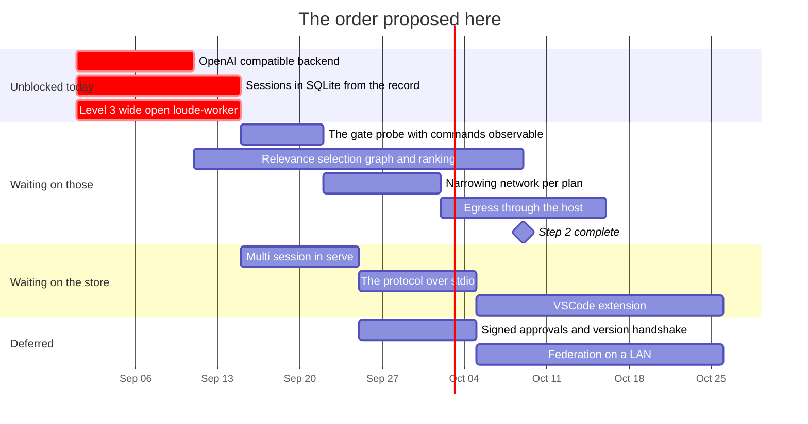

# Roadmap — revision 2026-09-01

**What this is:** the order of work as it stands on this date, and what blocks
what. Not a decision and not a description of the tree — for *what is true today*
read [`loude-design.md`](../../loude-design.md), and for *why* read the dated file
in [`RECORD/`](../../RECORD/) each item links to.

Supersedes [`ROADMAP/2026-08-31/`](../2026-08-31/) wholesale. That revision is
one day old and nothing in it landed, so nothing there is struck through — what
changed is not progress but **two facts and one premise**, and all three move the
order.

## What changed since yesterday

| | |
| --- | --- |
| **The premise** | "built for local inference" became "built for **local-first** inference" — [`local-first`](../../RECORD/2026-09-01.local-first.completed.md) |
| **A fact, measured** | Landlock is active in Docker Desktop's VM on an M1 Pro. Level 3 is reachable on a Mac today — [`the-container-decided`](../../RECORD/2026-09-01.the-container-decided.WIP.md) |
| **A fact, measured** | The repository map moves a 7B from 0/6 to 6/6 on files it holds, and leaves the placebo group flat — [`the-map-against-a-7b`](../../RECORD/2026-09-01.the-map-against-a-7b.completed.md) |

The first two reorder this revision. The third does not reorder anything; it
converts relevance selection's success criterion from a slogan into a test, which
is worth more than a reordering.

## The order

| # | Item | Blocked on | Argued in |
| --- | --- | --- | --- |
| 1 | ~~**An OpenAI-compatible backend**~~ — built, and never yet pointed at a real server | nothing | [`the-portal-and-the-gate`](../../RECORD/2026-08-31.the-portal-and-the-gate.completed.md) §Where it is right, [`local-first`](../../RECORD/2026-09-01.local-first.completed.md), closed by [`an-openai-compatible-backend`](../../RECORD/2026-09-01.an-openai-compatible-backend.completed.md) |
| 2 | ~~**Sessions in SQLite, derived from the record**~~ — the store and the parity; **not** the resume | nothing | [`state-of-play`](../../RECORD/2026-08-30.state-of-play.completed.md) · spec'd in [`session-store.md`](../2026-08-31/session-store.md), closed by [`sessions-in-sqlite`](../../RECORD/2026-09-02.sessions-in-sqlite.completed.md) |
| 3 | ~~**Level 3 in its development posture**~~ — `loude-worker` in a long-lived container, wide open; the image is **declared, not generated**, and no container has been started yet | nothing | [`the-container-decided`](../../RECORD/2026-09-01.the-container-decided.WIP.md), closed by [`the-worker-and-the-seam`](../../RECORD/2026-09-02.the-worker-and-the-seam.completed.md) |
| 4 | **The gate probe against a real model** | a person at the gate | [`the-gate-probe`](../../RECORD/2026-08-31.the-gate-probe.WIP.md) — written, unrun |
| 5 | **Relevance selection** — the reference graph and the ranking | nothing | [`the-repo-map`](../../RECORD/2026-08-31.the-repo-map.completed.md), scored by [`the-map-against-a-7b`](../../RECORD/2026-09-01.the-map-against-a-7b.completed.md) |
| 6 | **Narrowing: `network` per plan, then egress through the host** | 3 | [`the-container-decided`](../../RECORD/2026-09-01.the-container-decided.WIP.md) §Network, §Egress |
| 7 | **The protocol over stdio**, then the extension | 2 | [`how-a-surface-reaches-the-engine`](../../RECORD/2026-09-01.how-a-surface-reaches-the-engine.completed.md) |
| — | **Measurement across eight platforms** | per row; most of it on 1 | [`machines.md`](machines.md) — allocation and order |
| — | Federation | 2, and signed approvals | [`federation.md`](../2026-08-31/federation.md), unchanged |

[`gantt.html`](gantt.html) is every chart in this revision on one standalone page,
SVG inlined, no network needed — generated from the markdown in this directory by
[`scripts/render-gantt.mjs`](../../scripts/render-gantt.mjs), so edit the markdown and
re-run it rather than editing the page.

**The bars are sizes, not commitments.** They assume one person working evenings
and start from an arbitrary 1 September. The only thing worth trusting is the
*shape*: three items start at once because nothing blocks any of them, and the
container is one of the three for the first time.

Item 3 is the one that moved, and it moved on a fact rather than a preference.
Item 6 is new. Item 7 was surface #3 and is now decided rather than open.

## Why level 3 moved

Yesterday's revision had the container in the deferred row, on the strength of
[`tools-and-sandbox`](../../RECORD/2026-08-27.tools-and-sandbox.completed.md)'s finding that
it "isolates the same boundary level 2 does". That holds wherever level 2 exists.

It does not exist on macOS, and every machine this is being built on is a Mac.
Which means `run_command` has never been observed with a model in the loop
anywhere — the three command prompts of the gate probe's corpus are unaskable
today. The container is what makes them askable, and Landlock in the Docker VM was
measured rather than assumed.

**Level 3 therefore comes before, not after, the probe that needs it** — but in
its development posture, wide open, not in its finished one. Narrowing is item 6,
and its trigger is a fact rather than a date: the first `run_command` that runs
inside the container with a model in the loop.

## What actually blocks what

- **The session store blocks the extension and all of federation.** It blocks
  neither the container nor relevance selection, which is why 3 and 5 run beside
  it. *Half true as of the store landing: what the extension and federation
  actually need is a session that can be **resumed**, and storing the fold is the
  half of that which is derivable. The rest is its own record.*
- **Level 3 blocks the narrowing, and nothing else.** Its development posture is
  deliberately not a dependency of anything: it is wide open precisely so it does
  not become one. *No longer true, and the correction is the useful part: it also
  blocks every `run_command` on a Mac, which now includes a built feature — the
  exit-code rung — and not only the probe's three prompts.*
- **Relevance selection blocks nothing and is blocked by nothing**, and now has a
  scored baseline: get [`map-probe.txt`](../../scripts/tasks/map-probe.txt)'s
  group B into the map without growing it, and watch B move the way A did. That
  is the item most likely to be crowded out by work that feels more urgent, which
  is why it stays on the critical path.
- **Signed approvals still block the first *shared* off-loopback bind.**
  Narrower than it read yesterday: a bearer token now gates `/ws` and `/api/*`,
  and without one the bind is refused — see *Landed since this revision* below.
  That makes an off-loopback bind possible for one operator with one secret; it
  is not identity, so an approval still cannot say *who* approved it, and that
  is what federation needs. The second instance is unchanged: the IPC between
  the host and `loude-worker` carries approvals across a trust boundary inside
  one machine.

## Corrected from the previous revision

- Surface #1 said an OpenAI-compatible backend unblocks "the CLI and remote web
  at once — three targets". With the hardware now in play it is **five of six
  machines plus two hosted endpoints**, because their serving path is
  `llama-server`, Vulkan or a hosted API rather than Ollama. Same item, much
  larger payoff.
- Surface #3, "the protocol over stdio", was listed with its transport question
  open. It is decided: stdio, spawned per window, and the reason is the same
  ordering claim that governs federation.
- The engine track said relevance selection "has to beat the path-order
  baseline". It now has to do something specific and falsifiable instead, and the
  corpus to check it with exists.

## Landed since this revision was written

**Item 1 of the order above**, struck through in place. The implementation is
done and proven against a stub that reads the bytes off a socket; what is *not*
done is a single call to a real `llama-server`, vLLM or hosted endpoint, and the
distinction matters enough to keep in the row: a wire test proves we send what we
think and read what they send, not that they agree. The first real run belongs
with [`machines.md`](machines.md), and the thing to check first is whether
`usage` arrives at all — the design assumes `stream_options.include_usage` is
honoured and is built to survive it not being.

It also found the thing worth carrying into every later comparison: **the window
cannot be sent on this API**, so a run against a server started smaller than
`--context-limit` is not comparable to an Ollama run at the same number, and the
only place that shows is the gap between our count and `usage.prompt_tokens`.
The gantt below is left as it was drawn: the bar for this item was a size, and
striking the row is what records that it was wrong.

Three findings from
[`luu_architectural_audit_containerized.md`](luu_architectural_audit_containerized.md),
none of which waits on level 3 and two of which were enforcement this project
already claimed in prose. They are not rows in the order above — they came out of
the audit rather than out of the sequencing — and they are recorded here so this
revision can be read afterwards as *what was true while it was current*. Argued
and closed in
[`what-the-audit-left`](../../RECORD/2026-09-01.what-the-audit-left.completed.md):

- ~~`serve` binds where it is told and asks nobody~~ — a non-loopback bind is
  refused without `--auth-token-file`, before the listener exists; the token
  gates `/ws` and `/api/*`.
- ~~A child has a clock and nothing else~~ — `[sandbox.limits]` as `setrlimit`
  in the child. POSIX, so it is the first rung that holds a child on macOS at
  all. `RLIMIT_NPROC` shipped **off**, against the plan: the kernel counts it
  per uid, not per process tree.
- ~~`run_command` answers in a paragraph~~ — `exit_code`, `signal`, `stdout`,
  `stderr` and `duration_ms` are fields now, and the rendering the model reads
  is unchanged. This is what unblocks the closing ladder's next rung, which
  nothing in the order above covers and which is the honest thing this revision
  is missing.

## Landed after that, and what it did to the order

**The closing ladder's next rung**, which the paragraph above named as the thing
this revision was missing and which was therefore never a row. A plan carries
`closes_on`, one command line typed by the person at the gate and never asked of
the model, and the task folds itself on an exit code of 0. Every close now says
which authority folded it. Argued and built in
[`closing-on-an-exit-code`](../../RECORD/2026-09-02.closing-on-an-exit-code.completed.md).

**Item 2**, struck through above. What landed is the store and the parity
assertion `session-store.md` asked for; what did not is the *resume* the item's
motivation names. The distinction is kept in the row rather than smoothed over:
`SessionView` is the read side and `Context` is the write side, and folding one
back into the other is a second fold that wants a record of its own before it
wants code.

**And item 3 moved again, without being touched.** It was already before the gate
probe because `run_command` has never been observed with a model in the loop.
Building the closing rung found the second half of the same sentence: the rung
sits on `run_command`, so **it is code that cannot run wherever the kernel cannot
hold a child** — macOS, and this repository's own CI container. The container now
blocks a built feature as well as an unmade measurement, which is a stronger
claim on it than the one this revision opened with.

Two rows of the order are now struck. The three that are not — the probe, the
narrowing and relevance selection — are the same three, and **relevance selection
is the one nothing has moved in two revisions**, which is exactly what its row
predicted would happen to it.

**Item 3**, struck through above, and the row keeps what the strike would
otherwise smooth over. What landed is the seam, the worker, the runtime layer,
the image's manifest check and the wide-open posture file — all of it exercised
under `direct`, which is the runtime that puts no container around anything.
What has **not** happened is a single `docker build` of `Containerfile` followed
by a single tool call inside the container it produces. The distinction is the
same one item 1's row makes about a real `llama-server`, and for the same
reason: a wire test proves we send what we think, not that the other side agrees.
Argued and built in
[`the-worker-and-the-seam`](../../RECORD/2026-09-02.the-worker-and-the-seam.completed.md).

That leaves the order in a shape worth naming. Three of the five rows are struck,
and the two that remain are **the gate probe** (item 4, which item 3 was blocking
and no longer is) and **relevance selection** (item 5). The probe now waits only
on a person and a model. Relevance selection is untouched for a **third**
revision, which its own row predicted in the first — it "blocks nothing and is
blocked by nothing", and that turns out to describe what gets done to it rather
than what it is free to do.

Two findings from building it, neither of which was in the plan:

- **`[[worker.paths]]` had to exist.** `[sandbox]` has to resolve on *both* sides
  of the pipe, and the image's toolchain is at `/usr/local/cargo` while the host
  starting the container is a Mac. A granted path that is not there is a load
  error — deliberately, and the rule is worth keeping — so the trees that exist
  only inside the image needed a block that the host never resolves. It is the
  concrete case for sending the *policy* rather than resolved paths: `~/.cargo`
  and `/usr/local/cargo` are the same grant, and only one of them survives
  canonicalization.
- **The worker has to run as whoever started the session.** The base is
  bind-mounted, so a container running as root leaves root-owned files in the
  person's checkout — and `writes` in an approved plan is what the mount is
  *for*. Two spellings of one flag (`--user uid:gid`, `--uid`/`--gid`), which is
  the second thing this layer found that is not uniform across runtimes.

**And item 5 was touched at last, without being closed.** The row's own
prediction — that it is "the one nothing has moved in two revisions" — held for a
third, and then the thing that moved it produced a *negative* result worth more
than a quiet landing would have been. The reference graph and the ranking exist,
they explain themselves, and they are **off by default**, because measured
against the path-order baseline on this tree they hold two files where the
alphabet holds five. Argued and built in
[`ranking-the-map`](../../RECORD/2026-09-02.ranking-the-map.completed.md).

The row stays open, and it is a better-posed row than it was:

- **The corpus cannot compare two orders.** `map-probe.txt`'s group A is defined
  in its own comment as "the four files a 1024-token map actually holds" — the
  files a *path-ordered* map holds. It is the baseline's home turf by
  construction, so any reordering loses on it before a model is asked anything.
  The scoring this row cites was a real answer to *does a map help*, and it
  cannot be reused for *which map*. Building a corpus that can is now the first
  thing the row is blocked on, and it blocks nothing else.
- **Ranking and the fill rule are one decision.** Whole files, stopping at the
  first that does not fit, was chosen so a wider budget is always a superset of a
  tighter one. Under path order size and position were uncorrelated and it cost
  little; under rank order the big files lead, so the rule refuses everything
  behind them. Neither half can be settled without the other.
- **The entry points, transitively.** The record predicted that a graph ranks
  what is depended on rather than what is asked about, and that `serve.rs` and
  `lib.rs` would stay last. What it missed is that PageRank passes that low score
  *on*: `context.rs` fell out of the top ten because the files that reference it
  are the entry points. Whether weighted in-degree is the better aggregator here
  is now a named, unmeasured question.

So the order below ends this revision with **the same two rows open** it has had
throughout — the gate probe, still waiting on a person and a model, and relevance
selection, which is no longer untouched but is not closed either.

## Landed after that, a second time: the corpus itself

**Item 5's own still-open row** — "a corpus that can compare orders" — closed, and
the answer it gives is sharper than the flag `--map-rank` already shipped off with.
[`ranking-the-map`](../../RECORD/2026-09-02.ranking-the-map.completed.md)'s numbers
were real but came with a stated flaw: its comparison group was defined by what the
path-ordered map already held, so any reordering lost on it before a model answered
anything. The new corpus picks one question per file — all 38 the tree has — before
either order is checked, closing that gap.

It does not soften the result; it sharpens it. On the un-biased corpus path order
answers **100%** of what it holds and rank order **12.5%** of what it holds, and
rank order's denser files pushed the model into fabricated Rust that evicted the
session's own history 24 times in 38 turns where path order evicted nothing. Argued
and run in
[`the-map-order-probe`](../../RECORD/2026-09-03.the-map-order-probe.completed.md).

That leaves relevance selection's row closed on a negative result rather than an
unmeasured one — the row does not get a fourth revision of "untouched." What is
still open is named in the record: whether a different aggregator (weighted
in-degree, not PageRank) or a fill rule that trades monotonicity for the ranking's
own order would change the answer. Neither is a row here yet.

## When this revision is superseded

A new `ROADMAP/<date>/` directory, not an edit to this one. Items that land get
struck through here with a link to the record that closed them. The misses are
the useful part.
