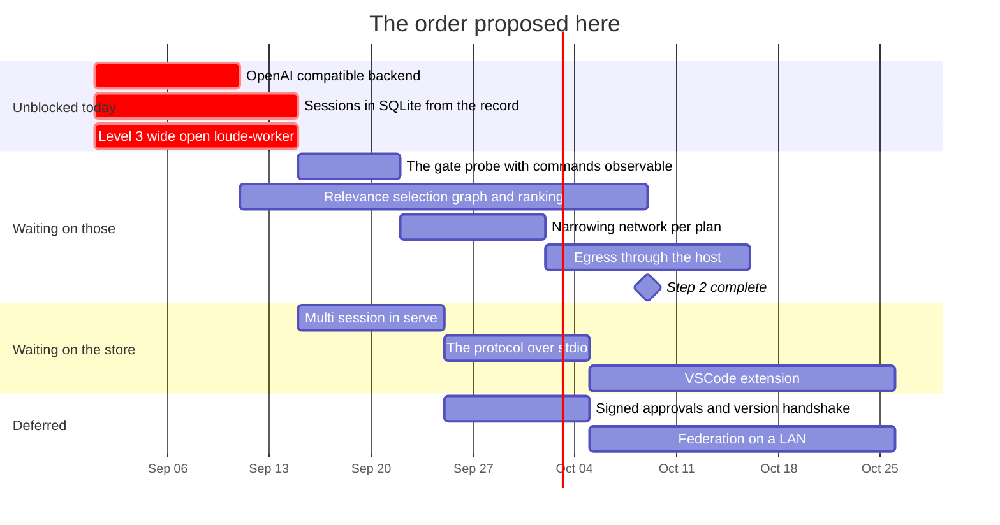

# Roadmap — revision 2026-09-01

**What this is:** the order of work as it stands on this date, and what blocks
what. Not a decision and not a description of the tree — for *what is true today*
read [`loude-design.md`](../../loude-design.md), and for *why* read the dated file
in [`RECORD/`](../../RECORD/) each item links to.

Supersedes [`ROADMAP/2026-08-31/`](../2026-08-31/) wholesale. That revision is
one day old and nothing in it landed, so nothing there is struck through — what
changed is not progress but **two facts and one premise**, and all three move the
order.

## What changed since yesterday

| | |
| --- | --- |
| **The premise** | "built for local inference" became "built for **local-first** inference" — [`local-first`](../../RECORD/2026-09-01.local-first.completed.md) |
| **A fact, measured** | Landlock is active in Docker Desktop's VM on an M1 Pro. Level 3 is reachable on a Mac today — [`the-container-decided`](../../RECORD/2026-09-01.the-container-decided.WIP.md) |
| **A fact, measured** | The repository map moves a 7B from 0/6 to 6/6 on files it holds, and leaves the placebo group flat — [`the-map-against-a-7b`](../../RECORD/2026-09-01.the-map-against-a-7b.completed.md) |

The first two reorder this revision. The third does not reorder anything; it
converts relevance selection's success criterion from a slogan into a test, which
is worth more than a reordering.

## The order

| # | Item | Blocked on | Argued in |
| --- | --- | --- | --- |
| 1 | **An OpenAI-compatible backend** | nothing | [`the-portal-and-the-gate`](../../RECORD/2026-08-31.the-portal-and-the-gate.completed.md) §Where it is right, [`local-first`](../../RECORD/2026-09-01.local-first.completed.md) |
| 2 | **Sessions in SQLite, derived from the record** | nothing | [`state-of-play`](../../RECORD/2026-08-30.state-of-play.completed.md) · spec'd in [`session-store.md`](../2026-08-31/session-store.md) |
| 3 | **Level 3 in its development posture** — `loude-worker` in a long-lived container, wide open | nothing | [`the-container-decided`](../../RECORD/2026-09-01.the-container-decided.WIP.md) |
| 4 | **The gate probe against a real model** | a person at the gate | [`the-gate-probe`](../../RECORD/2026-08-31.the-gate-probe.WIP.md) — written, unrun |
| 5 | **Relevance selection** — the reference graph and the ranking | nothing | [`the-repo-map`](../../RECORD/2026-08-31.the-repo-map.completed.md), scored by [`the-map-against-a-7b`](../../RECORD/2026-09-01.the-map-against-a-7b.completed.md) |
| 6 | **Narrowing: `network` per plan, then egress through the host** | 3 | [`the-container-decided`](../../RECORD/2026-09-01.the-container-decided.WIP.md) §Network, §Egress |
| 7 | **The protocol over stdio**, then the extension | 2 | [`how-a-surface-reaches-the-engine`](../../RECORD/2026-09-01.how-a-surface-reaches-the-engine.completed.md) |
| — | **Measurement across eight platforms** | per row; most of it on 1 | [`machines.md`](machines.md) — allocation and order |
| — | Federation | 2, and signed approvals | [`federation.md`](../2026-08-31/federation.md), unchanged |

[`gantt.html`](gantt.html) is every chart in this revision on one standalone page,
SVG inlined, no network needed — generated from the markdown in this directory by
[`scripts/render-gantt.mjs`](../../scripts/render-gantt.mjs), so edit the markdown and
re-run it rather than editing the page.

**The bars are sizes, not commitments.** They assume one person working evenings
and start from an arbitrary 1 September. The only thing worth trusting is the
*shape*: three items start at once because nothing blocks any of them, and the
container is one of the three for the first time.

Item 3 is the one that moved, and it moved on a fact rather than a preference.
Item 6 is new. Item 7 was surface #3 and is now decided rather than open.

## Why level 3 moved

Yesterday's revision had the container in the deferred row, on the strength of
[`tools-and-sandbox`](../../RECORD/2026-08-27.tools-and-sandbox.completed.md)'s finding that
it "isolates the same boundary level 2 does". That holds wherever level 2 exists.

It does not exist on macOS, and every machine this is being built on is a Mac.
Which means `run_command` has never been observed with a model in the loop
anywhere — the three command prompts of the gate probe's corpus are unaskable
today. The container is what makes them askable, and Landlock in the Docker VM was
measured rather than assumed.

**Level 3 therefore comes before, not after, the probe that needs it** — but in
its development posture, wide open, not in its finished one. Narrowing is item 6,
and its trigger is a fact rather than a date: the first `run_command` that runs
inside the container with a model in the loop.

## What actually blocks what

- **The session store blocks the extension and all of federation.** It blocks
  neither the container nor relevance selection, which is why 3 and 5 run beside
  it.
- **Level 3 blocks the narrowing, and nothing else.** Its development posture is
  deliberately not a dependency of anything: it is wide open precisely so it does
  not become one.
- **Relevance selection blocks nothing and is blocked by nothing**, and now has a
  scored baseline: get [`map-probe.txt`](../../scripts/tasks/map-probe.txt)'s
  group B into the map without growing it, and watch B move the way A did. That
  is the item most likely to be crowded out by work that feels more urgent, which
  is why it stays on the critical path.
- **Signed approvals still block the first *shared* off-loopback bind.**
  Narrower than it read yesterday: a bearer token now gates `/ws` and `/api/*`,
  and without one the bind is refused — see *Landed since this revision* below.
  That makes an off-loopback bind possible for one operator with one secret; it
  is not identity, so an approval still cannot say *who* approved it, and that
  is what federation needs. The second instance is unchanged: the IPC between
  the host and `loude-worker` carries approvals across a trust boundary inside
  one machine.

## Corrected from the previous revision

- Surface #1 said an OpenAI-compatible backend unblocks "the CLI and remote web
  at once — three targets". With the hardware now in play it is **five of six
  machines plus two hosted endpoints**, because their serving path is
  `llama-server`, Vulkan or a hosted API rather than Ollama. Same item, much
  larger payoff.
- Surface #3, "the protocol over stdio", was listed with its transport question
  open. It is decided: stdio, spawned per window, and the reason is the same
  ordering claim that governs federation.
- The engine track said relevance selection "has to beat the path-order
  baseline". It now has to do something specific and falsifiable instead, and the
  corpus to check it with exists.

## Landed since this revision was written

Three findings from
[`luu_architectural_audit_containerized.md`](luu_architectural_audit_containerized.md),
none of which waits on level 3 and two of which were enforcement this project
already claimed in prose. They are not rows in the order above — they came out of
the audit rather than out of the sequencing — and they are recorded here so this
revision can be read afterwards as *what was true while it was current*. Argued
and closed in
[`what-the-audit-left`](../../RECORD/2026-09-01.what-the-audit-left.completed.md):

- ~~`serve` binds where it is told and asks nobody~~ — a non-loopback bind is
  refused without `--auth-token-file`, before the listener exists; the token
  gates `/ws` and `/api/*`.
- ~~A child has a clock and nothing else~~ — `[sandbox.limits]` as `setrlimit`
  in the child. POSIX, so it is the first rung that holds a child on macOS at
  all. `RLIMIT_NPROC` shipped **off**, against the plan: the kernel counts it
  per uid, not per process tree.
- ~~`run_command` answers in a paragraph~~ — `exit_code`, `signal`, `stdout`,
  `stderr` and `duration_ms` are fields now, and the rendering the model reads
  is unchanged. This is what unblocks the closing ladder's next rung, which
  nothing in the order above covers and which is the honest thing this revision
  is missing.

## When this revision is superseded

A new `ROADMAP/<date>/` directory, not an edit to this one. Items that land get
struck through here with a link to the record that closed them. The misses are
the useful part.
