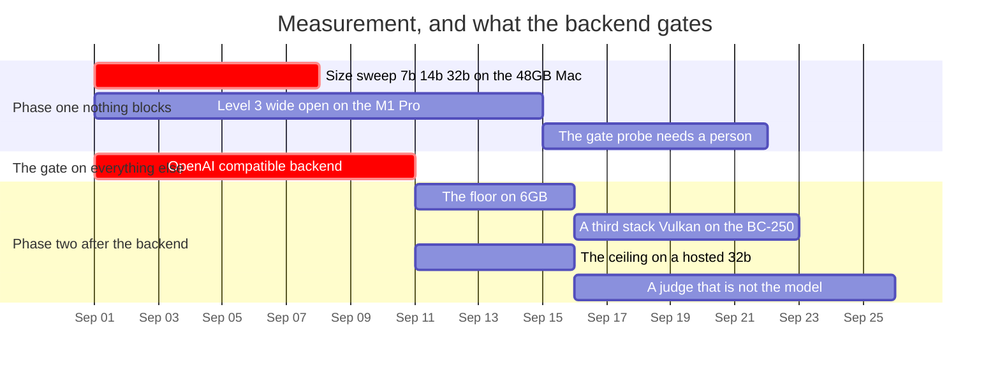

# The machines, and what each one can uniquely answer

Allocation and order only. *What* each run measures and *how to read it* lives in
the record each row links to — this file exists because eight platforms arrived at
once and the question stopped being "what should we measure" and became "on which
box, in what order, and what does that box tell us that no other one does".

**The organising rule:** one machine, one question nothing else can answer.
Running the same corpus everywhere produces numbers that cannot be compared —
different silicon, different quantisation, different serving stack — and the
project's whole measurement discipline rests on *one flag apart*. A run that
changes the machine changes more than a flag.

**The allocation has no record behind it**, in the sense
[`surface.md`](../2026-08-31/surface.md) means: the runs are specified elsewhere,
but which hardware answers which question has never been argued. Read it as
ordering.

## The inventory

Bandwidth figures are from specification, not measured here, and they are in the
table because for a memory-bound 7B they decide the speed and the ceiling decides
what fits at all.

| # | Machine | Memory for weights | ~Bandwidth | Ceiling at Q4 |
| --- | --- | --- | --- | --- |
| 1 | **M1 Pro, 16 GB** — macOS 26.3.1 | 16 GB unified | ~200 GB/s | 7B comfortable, 14b tight |
| 2 | **Mac mini M4, 16 GB** | 16 GB unified | ~120 GB/s | same, slower |
| 3 | **MacBook M4 Pro, 48 GB** | 48 GB unified | ~273 GB/s | **32b comfortable** |
| 4 | **Ryzen 5 3600 + RTX 5060 Ti** | 16 GB VRAM | ~448 GB/s | 14b comfortable |
| 5 | **i5 9400F + GTX 1660 Super** | 6 GB VRAM | ~336 GB/s | 7B at the edge |
| 6 | **BC-250** — Zen 2 + RDNA 2 | 16 GB GDDR6 | ~224 GB/s | 14b comfortable |
| P1 | **BytePlus ModelArk** | — | — | whatever it serves |
| P2 | **build.nvidia.com**, free tier | — | — | whatever it serves |

Machine 1 is where everything so far has run:
[`the-map-against-a-7b`](../../RECORD/2026-09-01.the-map-against-a-7b.completed.md)
is the grounded pair and the map probe, both at two budgets, on that box.

## What each one is for

| Machine | The question only it answers | Specified in |
| --- | --- | --- |
| ~~**3 · M4 Pro 48 GB**~~ | ~~Does the map's 0/6 → 6/6 survive at 14b and 32b?~~ Yes, at both — and each size fails the rest of the corpus in its own way, one of them a live sighting of `run_command` refusing on macOS. Closed by [`the-size-sweep`](../../RECORD/2026-09-03.the-size-sweep.completed.md) | [`the-map-against-a-7b`](../../RECORD/2026-09-01.the-map-against-a-7b.completed.md) §The map probe |
| **1 · M1 Pro** | **`run_command` with a model in the loop.** Landlock is active in its Docker VM, so the gate probe's command prompts become observable for the first time anywhere | [`the-container-decided`](../../RECORD/2026-09-01.the-container-decided.WIP.md), [`the-gate-probe`](../../RECORD/2026-08-31.the-gate-probe.completed.md) |
| **5 · 1660 Super, 6 GB** | **Where the stated target breaks.** The project claims 7B–32B at 8K–32K; 6 GB is the bottom of that claim and the only box that can falsify it | — needs a record |
| **6 · BC-250** | **A third serving stack.** Neither Metal nor CUDA — llama.cpp over Vulkan, which is the only non-vendor path in the inventory | — needs a record |
| **4 · Ryzen + 5060 Ti** | **Native Linux without a VM**, and the fastest box for anything that fits in 16 GB | — |
| **P1 · ModelArk** | **A judge that is not the model under test**, so probe scoring stops being fifteen answers read by hand | [`local-first`](../../RECORD/2026-09-01.local-first.completed.md) §Still open — the design says the judge is the same model, and that has to be argued with first |
| **P2 · build.nvidia.com** | **A ceiling.** The same open-weight family at a size no local box holds — but a different quantisation and serving stack, so it is a bound, never an A/B | — needs a record |
| **2 · M4 mini** | Nothing the others do not. Second opinion on 1, and a second host the day federation is testable | — |

## Order

Two phases, and the split is not preference: everything in phase two needs a
backend that does not exist.

**Phase one — nothing blocks these.**

1. **Size sweep on the 48 GB Mac.** `map-probe.txt` and the grounded pair at
   `qwen2.5-coder` 7b / 14b / 32b, `--map-tokens 0` against `1024`, sampling
   pinned. Ollama only, no new code. This is the largest unanswered question the
   inventory can close today.
2. **The container run on the M1 Pro**, in its development posture — roadmap item
   3. Ends with the gate probe's command half being askable.
3. **The gate probe itself**, which needs a person and therefore cannot be
   parallelised across boxes. Machine 1, after 2.

**Phase two — all of it blocked on roadmap item 1, the OpenAI-compatible
backend.** Machines 4, 5 and 6 and both providers reach a model through
`llama-server`, Vulkan or a hosted endpoint, and `BackendKind` is `Mock | Ollama`.
Until that lands, five of six machines and both providers can only be used by
pretending they are Ollama, which measures the pretence.

4. **The floor**, on machine 5: how much context a 6 GB card actually gives a 7B,
   and where the answer stops being 8K.
5. **The third stack**, on machine 6: whether anything in the tree assumes CUDA or
   Metal without saying so.
6. **The ceiling**, on P2: the same corpus against a size no local box holds.
7. **The judge**, on P1 — and only after the design's "the judge is the same
   model" has been argued with in a record rather than routed around.

## What not to run, and why

- **Not the grounded pair on every box.** Token accounting is backend-independent
  and already recorded; re-running it elsewhere measures the machine, which is not
  what the corpus was built to ask.
- **Not a hosted model against a local one as an A/B.** Different quantisation and
  serving stack: it is a ceiling or a floor, never one flag apart.
- **Not 14b or 32b before 7b answers.** [`the-gate-probe`](../../RECORD/2026-08-31.the-gate-probe.completed.md)
  already defers the size sweep for the gate, and the reasoning holds for the map:
  if a 7B can be planned with, the larger models are not the question.
- **Not anything on machines 4, 5 or 6 through Ollama** just because it is
  installable. It would work, and it would answer the phase-two questions with the
  phase-one stack, which is the wrong instrument wearing the right label.

## Open

- **Whether the size sweep needs the 48 GB box at all**, or whether a hosted 32b
  answers it more cheaply. It does not: the hosted one changes quantisation and
  sampler at the same time. But if the local sweep is expensive to arrange, that
  trade is worth stating rather than assumed.
- **Landlock on machines 4 and 6**, once either runs Linux, and inside Apple's
  `container` if it is ever installed. One command each, and it decides whether
  the box can hold a subprocess at all.
- **Nothing here measures latency**, deliberately: every corpus in this repository
  scores answers, not seconds. A machine comparison that ignores speed is odd
  enough to be worth saying out loud, and the reason is that speed does not
  falsify anything the project claims.
