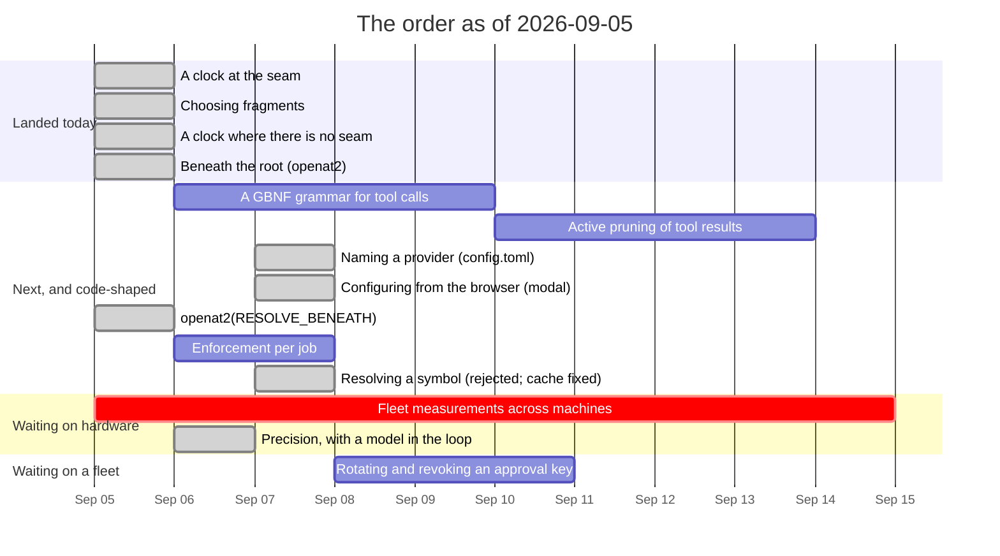

# Roadmap — revision 2026-09-05

**What this is:** the order of work as it stands on this date, and what blocks
what. Not a decision and not a description of the tree — for *what is true today*
read [`luu-design.md`](../../luu-design.md), and for *why* read the dated file
in [`RECORD/`](../../RECORD/) each item links to.

Supersedes [`ROADMAP/2026-09-04/`](../2026-09-04/) wholesale. That revision ended
with **one open item and no code in it**: everything else had landed, and item 5
wants hardware rather than a keyboard. A roadmap in that state is not finished,
it is *unwritten* — so this revision does the thing the previous one deferred and
puts the design's open questions in an order, with the one that was closed today
struck through at the top of it.

## What landed since 2026-09-04

| | |
| --- | --- |
| **A clock at the seam** | A worker that is *alive and stuck* used to hang the turn, the job and the session in silence. The host's deadline for a call is now the call's own clock plus `[worker] timeout-ms`, firing kills the worker, and the next call starts another — plus a ceiling on `timeout_ms`, which was the model's number and was checked against nothing — [`a-clock-at-the-seam`](../../RECORD/2026-09-05.a-clock-at-the-seam.completed.md) |
| **A clock where there is no seam** | The morning's clock was at the seam, and `runtime = "host"` — the default — has none. It moved up into the agent loop, which is the only thing above both places a tool can run. Underneath it: `std::fs` inline in an `async` block never yields, so the timeout beside it never fired; and a runtime will not shut down while a blocking thread is parked, so the hang came back at process exit — [`a-clock-where-there-is-no-seam`](../../RECORD/2026-09-05.a-clock-where-there-is-no-seam.completed.md) |
| **Beneath the root** | The in-process TOCTOU, open since `tools-and-sandbox` and admitted in a doc comment ever since: a check answers about a path, and between it and the open the path is a string. The file tools now open with `openat2(RESOLVE_BENEATH)` relative to the granting root, and an in-process read is held by the kernel for the first time — which the verdict says, because where the syscall is missing it is still not — [`beneath-the-root`](../../RECORD/2026-09-05.beneath-the-root.completed.md) |
| **Selection at the gate** (2026-09-06) | Not an item on this revision, because the gap was only measurable once precision was: the mechanism that scores **33 of 38** existed in `chat` alone, while `serve` and `stdio` — the surfaces a person and an editor work in — ran on the map, which scores **8**. Both now take `--select-tokens`, the tree is walked once at startup beside the map, and the selection is read through the **live job's** sandbox, so an approved plan narrows what may be chosen exactly as it narrows what may be opened. End to end: the planning call selects over the whole tree at 2 678 prompt tokens, the model's plan grants one file, the approved turn selects at 797 — which is the narrowing, and is also a new cost, because the plan bounding the selector is one a 7B wrote — [`selection-at-the-gate`](../../RECORD/2026-09-06.selection-at-the-gate.completed.md) |
| **Does the model read it?** (2026-09-06) | Item 10, which this revision ordered behind hardware it never needed. The same 38 questions one flag apart against `qwen2.5-coder:7b`: **0 of 38 with nothing in the prompt, 8 with the map, 33 with the selection**, and 91% precision on the 33 targets the selector held. All three predictions the protocol filed were falsified, the useful one being that position inside the bucket does not matter — held-but-not-first scores 13/14 against first place's 17/19. The cost is the finding nobody was looking for: fragments stay in history, so the arm evicted 31 times, prefix reuse fell from 93% to 17.7%, and it took 11.6× the wall clock — [`does-the-model-read-it`](../../RECORD/2026-09-06.does-the-model-read-it.completed.md) |
| **Choosing fragments** | The `code` bucket, zero in every recording this repository has ever made, now fills itself with what the turn's own text points at. At 1024 tokens a path-ordered map holds the answer to 3 of the corpus's 38 questions and a selection holds 32. The reference graph's one-hop expansion was measured and **lost a third time**, so it ships off — [`choosing-fragments`](../../RECORD/2026-09-05.choosing-fragments.completed.md) |

## The order

| # | Item | Blocked on | Argued in |
| --- | --- | --- | --- |
| 1 | ~**A tool call has no timeout at the seam** — the host holds the clock, a stuck worker is killed and replaced, and `timeout_ms` gets a ceiling~ | nothing | [`a-clock-at-the-seam`](../../RECORD/2026-09-05.a-clock-at-the-seam.completed.md) |
| 2 | ~**Relevance over recency: choosing fragments** — inject the fragments the turn points at, not the whole history~ **coverage measured and won; precision measured and won too — item 10** | nothing | [`choosing-fragments`](../../RECORD/2026-09-05.choosing-fragments.completed.md) |
| 3 | **Fleet measurement across target machines** — the hardware floor (6 GB card), native Linux confinement without a VM, and the BC-250's 14B ceiling | hardware and a hand on it, nothing else | [`machines.md`](machines.md) |
| 4 | **A grammar for tool calls** — the text parse reads the block correctly; what fails is that generation does not stop. **Narrowed on 2026-09-06: tool calls only, the plan block stays as it is** | nothing — `llama-server` is reachable through the OpenAI backend | [`a-grammar-for-tool-calls`](../../RECORD/2026-09-06.a-grammar-for-tool-calls.WIP.md) |
| 5 | ~**A clock where there is no seam** — the deadline moved up into the agent loop, the in-process tools stopped blocking inside their own future, and a worker restart is counted~ | nothing | [`a-clock-where-there-is-no-seam`](../../RECORD/2026-09-05.a-clock-where-there-is-no-seam.completed.md) |
| 6 | **What leaves the history** — a `cat` capped at 8 KiB and a selected fragment are the same object to the window, so this now covers both. **By turn 20 of the precision run, ~90% of the history block is quoted code** | nothing — the run that measures it is already on disk | [`what-leaves-the-history`](../../RECORD/2026-09-06.what-leaves-the-history.WIP.md) |
| 7 | ~**`openat2(RESOLVE_BENEATH)` for the in-process tools** — the kernel refuses the escape during resolution, and the verdict says so it was the kernel~ | nothing | [`beneath-the-root`](../../RECORD/2026-09-05.beneath-the-root.completed.md) |
| 8 | **Enforcement per job** — `network` and `egress` narrow per job; `enforcement` is still session-wide | nothing | `luu-design.md` §Open questions |
| 10 | ~**Precision, with a model in the loop** — coverage says the right file was in the prompt; nothing says the model used it. The same 38 questions, one flag apart, scored against a 7B~ **33 of 38 against the baseline's 0; 91% precision on what the selector held. The block was wrong: machine 1 of `machines.md` is the M1 Pro this ran on** | nothing — it never needed the hardware it was ordered behind | [`does-the-model-read-it`](../../RECORD/2026-09-06.does-the-model-read-it.completed.md) |
| 9 | **Rotating and revoking an approval key** — a compromised key is removed by editing `luu.toml` and restarting. Also: nothing signs a *recording*, so a reader that dropped lines is not detected | item 8 is unrelated; this waits on a fleet being more than the boxes in one room | [`signed-approvals`](../../RECORD/2026-09-04.signed-approvals.completed.md) §Still open |
| 11 | ~**Naming a provider** — where a model lives, written down once: `[provider.<name>]` in the state directory's `config.toml`, `-p <name>` and `-m <model>`, and a `default` profile that will not load pointing off the machine without `remote = true`~ **answered `local-first`'s first open question with *not `luu.toml`*, and narrowed the declaration to the default profile alone the same day it was written: `-p` is the destination being typed** | nothing | [`naming-a-provider`](../../RECORD/2026-09-07.naming-a-provider.completed.md) |
| 12 | ~**Configuring from the browser** — a modal with what this server resolved (read-only, including the window caveat nobody in a browser ever saw) and the providers (editable, **loopback only**). ~ **corrected item 11's closing sentence — editing the file is not a picker — and inverted its own: the browser never classifies a URL, the loader refuses the write and names the host to type back, so the rule has one implementation** | nothing | [`configuring-from-the-browser`](../../RECORD/2026-09-07.configuring-from-the-browser.completed.md) |
| 13 | ~**Resolving a symbol** — a symbol index keyed on `(path, qualified name)`, so a citation can be re-resolved after an edit~ **rejected the day it was written, and the reading that rejected it found the live bug underneath: `walk_sources` ran once per process and nothing refreshed it, so an edited file stayed selectable at its *startup line numbers* and the loader read the current file at them. Fixed with a stamp and `rewalk_sources`; the index is not being built and `edit_file`'s `old_string` stays the model's, because deriving it from disk would remove the optimistic lock. **The two-turn test at the `serve` seam, run against the fix removed, hands turn two four lines of padding as the definition it asked for** | nothing | [`resolving-a-symbol`](../../RECORD/2026-09-07.resolving-a-symbol.completed.md) §later |

## What actually blocks what

- **Item 2 landed, and item 10 closed it the next day.** Selection beat the
  baseline it had to beat — 33 of 38 against 3 at 1024 tokens — on a corpus that
  can now be scored **with no model at all**, because
  [`map-order-probe.key`](../../scripts/tasks/map-order-probe.key) puts the
  answers on disk and `cargo test -p luu --test select_probe` computes coverage
  on every commit. What that cannot say is whether a model *uses* what it was
  handed, which is precision. That needed a model rather than the *fleet* box
  this revision assumed, and the model was already on the machine: 33 of 38, at
  91% precision on what it held, against a baseline that scored **zero**.
- **The reference graph has now lost three times**, the last one on the question
  it was built for. It is still in the tree and still switchable, and nothing
  defaults to it. A fourth attempt needs to argue against the table in
  [`choosing-fragments`](../../RECORD/2026-09-05.choosing-fragments.completed.md),
  not around it — but **one of the three reasons for rejecting it is now known to
  be wrong**. It was rejected partly for moving the right file out of first place
  five times in 38, and the precision run shows first place is not what pays:
  held-but-not-first answers correctly 13 times in 14. Coverage and tokens are
  what a fourth attempt has to beat; ranking position is not.
- **Item 3 is unblocked by everything and blocked by geography.** All three
  remaining measurements need a box that is not this one; see
  [`machines.md`](machines.md) for which one answers which question. Nothing in
  the tree is waiting on them, which is why they are no longer at the top.
- **Item 5 landed, and it moved item 1's clock rather than adding a second
  one.** A deadline at the seam covers the mode almost nobody runs; the loop is
  above both. Two findings under it that are worth more than the item was: a
  `tokio::time::timeout` around a blocking `std::fs` call **never fires**,
  because the future never yields and the timer is never polled; and a tokio
  runtime waits for its blocking threads at drop, so an abandoned read that the
  turn survived comes back as a process that will not exit. Both are now closed
  and both are the kind of thing that only shows up when the test hangs *after*
  passing.
- **Item 7 closed a hole this repository had been admitting in a doc comment
  since August.** The interesting part is not the syscall, it is that an
  in-process read now reports `Applied::Kernel`: the line in `luu-design.md`
  saying an in-process check is *all an in-process tool can have* had been true
  since the sandbox existed and is not any more. Where `openat2` is missing the
  old sentence is still the true one, which is why the mechanism is in the
  verdict rather than in a comment.
- **Item 11 is the first entry this revision did not order.** It came from a
  *Still open* line rather than from the table — `local-first` asked whether
  `luu.toml` grows provider profiles, and nothing was scheduled to answer it
  because retyping four flags is an irritation rather than a defect. What makes
  it code-shaped is the second half: a named destination is commitment 3
  (*nothing leaves the machine without the destination having been typed*)
  weakened, and the file has to be built to hold what is left of it.
- **Item 13 was proposed and rejected on the same day, and it still paid.** The
  proposal was a symbol index; the reading done to schedule it found that the
  failure the index was invented for is **already in the tree and caused by
  something else**. `walk_sources` was called once per process and `app.walked`
  was read every turn and never refreshed, so a file the session edited did not
  become unselectable — it stayed selectable at its startup line numbers, and
  `crate::fragment` read the *current* file at them. Wrong lines, right path,
  presented as the definition. The comment beside the cache drew the benign
  conclusion ("not selectable until a restart") and that is the sentence the fix
  had to correct. A stamp per file and a re-walk of what moved closes it; the
  index closes nothing that is left. **`--select-tokens` was the only flag
  affected, and it is off by default, so no recording on disk is invalidated.**

- **Items 4 and 6 were argued on 2026-09-06, and both came back changed.** A
  roadmap entry is a link to an argument, and until that day these two linked to
  the design's open questions instead — the honest way to say *ordered but not
  yet argued*. Writing the arguments moved both items: **4 lost the plan block**
  (the gate probe's own numbers say the plan format is not what is broken, and a
  grammar there would make `PlanSource::Prose` unreachable), and **6 grew the
  fragment half** of `selection-at-the-gate`'s open threads, because an 8 KiB
  `cat` and a 1 000-token fragment are the same object to the window. Neither
  change is visible from the row it started as, which is the argument for writing
  the record before the code rather than after it.
