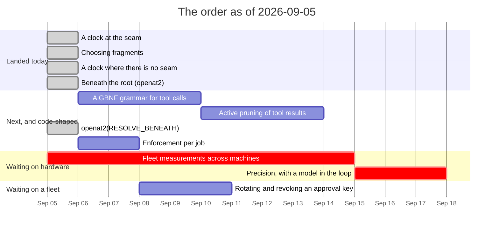

# Roadmap — revision 2026-09-05

**What this is:** the order of work as it stands on this date, and what blocks
what. Not a decision and not a description of the tree — for *what is true today*
read [`luu-design.md`](../../luu-design.md), and for *why* read the dated file
in [`RECORD/`](../../RECORD/) each item links to.

Supersedes [`ROADMAP/2026-09-04/`](../2026-09-04/) wholesale. That revision ended
with **one open item and no code in it**: everything else had landed, and item 5
wants hardware rather than a keyboard. A roadmap in that state is not finished,
it is *unwritten* — so this revision does the thing the previous one deferred and
puts the design's open questions in an order, with the one that was closed today
struck through at the top of it.

## What landed since 2026-09-04

| | |
| --- | --- |
| **A clock at the seam** | A worker that is *alive and stuck* used to hang the turn, the job and the session in silence. The host's deadline for a call is now the call's own clock plus `[worker] timeout-ms`, firing kills the worker, and the next call starts another — plus a ceiling on `timeout_ms`, which was the model's number and was checked against nothing — [`a-clock-at-the-seam`](../../RECORD/2026-09-05.a-clock-at-the-seam.completed.md) |
| **A clock where there is no seam** | The morning's clock was at the seam, and `runtime = "host"` — the default — has none. It moved up into the agent loop, which is the only thing above both places a tool can run. Underneath it: `std::fs` inline in an `async` block never yields, so the timeout beside it never fired; and a runtime will not shut down while a blocking thread is parked, so the hang came back at process exit — [`a-clock-where-there-is-no-seam`](../../RECORD/2026-09-05.a-clock-where-there-is-no-seam.completed.md) |
| **Beneath the root** | The in-process TOCTOU, open since `tools-and-sandbox` and admitted in a doc comment ever since: a check answers about a path, and between it and the open the path is a string. The file tools now open with `openat2(RESOLVE_BENEATH)` relative to the granting root, and an in-process read is held by the kernel for the first time — which the verdict says, because where the syscall is missing it is still not — [`beneath-the-root`](../../RECORD/2026-09-05.beneath-the-root.completed.md) |
| **Choosing fragments** | The `code` bucket, zero in every recording this repository has ever made, now fills itself with what the turn's own text points at. At 1024 tokens a path-ordered map holds the answer to 3 of the corpus's 38 questions and a selection holds 32. The reference graph's one-hop expansion was measured and **lost a third time**, so it ships off — [`choosing-fragments`](../../RECORD/2026-09-05.choosing-fragments.completed.md) |

## The order

| # | Item | Blocked on | Argued in |
| --- | --- | --- | --- |
| 1 | ~**A tool call has no timeout at the seam** — the host holds the clock, a stuck worker is killed and replaced, and `timeout_ms` gets a ceiling~ | nothing | [`a-clock-at-the-seam`](../../RECORD/2026-09-05.a-clock-at-the-seam.completed.md) |
| 2 | ~**Relevance over recency: choosing fragments** — inject the fragments the turn points at, not the whole history~ **coverage measured and won; precision unmeasured and now item 10** | nothing | [`choosing-fragments`](../../RECORD/2026-09-05.choosing-fragments.completed.md) |
| 3 | **Fleet measurement across target machines** — the hardware floor (6 GB card), native Linux confinement without a VM, and the BC-250's 14B ceiling | hardware and a hand on it, nothing else | [`machines.md`](machines.md) |
| 4 | **A GBNF grammar for tool calls** — replace the text parse with a grammar the server enforces, against Qwen2.5-Coder | nothing — `llama-server` is reachable through the OpenAI backend | [`an-openai-compatible-backend`](../../RECORD/2026-09-01.an-openai-compatible-backend.completed.md) — **needs its own record** |
| 5 | ~**A clock where there is no seam** — the deadline moved up into the agent loop, the in-process tools stopped blocking inside their own future, and a worker restart is counted~ | nothing | [`a-clock-where-there-is-no-seam`](../../RECORD/2026-09-05.a-clock-where-there-is-no-seam.completed.md) |
| 6 | **Active pruning of tool results** — a `cat` of 2 000 lines is capped at 8 KiB and then never shortened. The cap is not the strategy | nothing — closed jobs exist in quantity now that the store keeps them | `luu-design.md` §Still ahead — **needs its own record** |
| 7 | ~**`openat2(RESOLVE_BENEATH)` for the in-process tools** — the kernel refuses the escape during resolution, and the verdict says so it was the kernel~ | nothing | [`beneath-the-root`](../../RECORD/2026-09-05.beneath-the-root.completed.md) |
| 8 | **Enforcement per job** — `network` and `egress` narrow per job; `enforcement` is still session-wide | nothing | `luu-design.md` §Open questions |
| 10 | **Precision, with a model in the loop** — coverage says the right file was in the prompt; nothing says the model used it. The same 38 questions, one flag apart, scored against a 7B | a box from [`machines.md`](machines.md), which is item 3 | [`choosing-fragments`](../../RECORD/2026-09-05.choosing-fragments.completed.md) §What this run does not say |
| 9 | **Rotating and revoking an approval key** — a compromised key is removed by editing `luu.toml` and restarting. Also: nothing signs a *recording*, so a reader that dropped lines is not detected | item 8 is unrelated; this waits on a fleet being more than the boxes in one room | [`signed-approvals`](../../RECORD/2026-09-04.signed-approvals.completed.md) §Still open |

## What actually blocks what

- **Item 2 landed, and its second half is now item 10.** Selection beat the
  baseline it had to beat — 32 of 38 against 3 at 1024 tokens — on a corpus that
  can now be scored **with no model at all**, because
  [`map-order-probe.key`](../../scripts/tasks/map-order-probe.key) puts the
  answers on disk and `cargo test -p luu --test select_probe` computes coverage
  on every commit. What that cannot say is whether a model *uses* what it was
  handed, which is precision, which needs a box, and which is why item 10 exists
  rather than being folded into a line that reads as finished.
- **The reference graph has now lost three times**, the last one on the question
  it was built for. It is still in the tree and still switchable, and nothing
  defaults to it. A fourth attempt needs to argue against the table in
  [`choosing-fragments`](../../RECORD/2026-09-05.choosing-fragments.completed.md),
  not around it.
- **Item 3 is unblocked by everything and blocked by geography.** All three
  remaining measurements need a box that is not this one; see
  [`machines.md`](machines.md) for which one answers which question. Nothing in
  the tree is waiting on them, which is why they are no longer at the top.
- **Item 5 landed, and it moved item 1's clock rather than adding a second
  one.** A deadline at the seam covers the mode almost nobody runs; the loop is
  above both. Two findings under it that are worth more than the item was: a
  `tokio::time::timeout` around a blocking `std::fs` call **never fires**,
  because the future never yields and the timer is never polled; and a tokio
  runtime waits for its blocking threads at drop, so an abandoned read that the
  turn survived comes back as a process that will not exit. Both are now closed
  and both are the kind of thing that only shows up when the test hangs *after*
  passing.
- **Item 7 closed a hole this repository had been admitting in a doc comment
  since August.** The interesting part is not the syscall, it is that an
  in-process read now reports `Applied::Kernel`: the line in `luu-design.md`
  saying an in-process check is *all an in-process tool can have* had been true
  since the sandbox existed and is not any more. Where `openat2` is missing the
  old sentence is still the true one, which is why the mechanism is in the
  verdict rather than in a comment.
- **Items 2, 4 and 6 have no record yet, and that is the next thing each of them
  needs.** A roadmap entry is a link to an argument; three of these link to the
  design's open questions instead, which is the honest way to say *this is
  ordered but not yet argued*.
