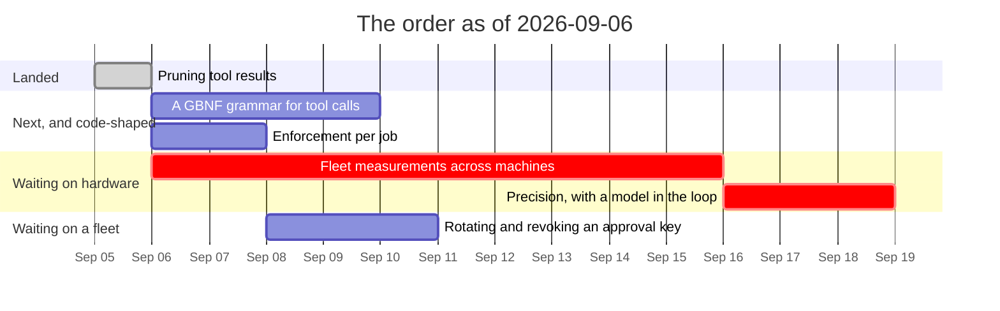

# Roadmap — revision 2026-09-06

**What this is:** the order of work as it stands on this date, and what blocks
what. Not a decision and not a description of the tree — for *what is true today*
read [`luu-design.md`](../../luu-design.md), and for *why* read the dated file
in [`RECORD/`](../../RECORD/) each item links to.

Supersedes [`ROADMAP/2026-09-05/`](../2026-09-05/) wholesale. That revision put
the design's open questions in an order and noted that three of them — items 2, 4
and 6 — linked to the design doc rather than to an argument, which is the honest
way to say *ordered but not yet argued*. **One of the three now has its
argument**, and the order below is otherwise the same one: nothing was reordered
by the work, which is what a roadmap looks like when it is being used rather than
rewritten.

## What landed since 2026-09-05

| | |
| --- | --- |
| **Pruning tool results** | A tool result was written once and paid for on every call until its turn left the window — capped at 8 KiB per result, unbounded in their sum. A second floor now sends an old result's *call* verbatim and its *output* as a digest built from the structured fields. It runs before eviction, so the trade is bytes for turns: on twelve turns that each read a real file at 8K, `--prune off` **evicted six of its twelve turns** and pruning evicted none, at 39% fewer prompt tokens. The two policies split exactly as `--evict turn` and `--evict block` do — [`pruning-tool-results`](../../RECORD/2026-09-05.pruning-tool-results.completed.md) |

## The order

| # | Item | Blocked on | Argued in |
| --- | --- | --- | --- |
| 3 | **Fleet measurement across target machines** — the hardware floor (6 GB card), native Linux confinement without a VM, and the BC-250's 14B ceiling | hardware and a hand on it, nothing else | [`machines.md`](machines.md) |
| 4 | **A GBNF grammar for tool calls** — replace the text parse with a grammar the server enforces, against Qwen2.5-Coder | nothing — `llama-server` is reachable through the OpenAI backend | [`an-openai-compatible-backend`](../../RECORD/2026-09-01.an-openai-compatible-backend.completed.md) — **needs its own record** |
| 6 | ~**Active pruning of tool results** — a `cat` of 2 000 lines is capped at 8 KiB and then never shortened. The cap is not the strategy~ **shipped off, measured on the mock; whether a model still answers from a digest is item 10's run** | nothing | [`pruning-tool-results`](../../RECORD/2026-09-05.pruning-tool-results.completed.md) |
| 8 | **Enforcement per job** — `network` and `egress` narrow per job; `enforcement` is still session-wide | nothing | `luu-design.md` §Open questions — **needs its own record** |
| 10 | **Precision, with a model in the loop** — coverage says the right file was in the prompt; nothing says the model used it. Now also: nothing says a model reads `[read_file] ok` as *I already read this* rather than as *the file was empty* | a box from [`machines.md`](machines.md), which is item 3 | [`choosing-fragments`](../../RECORD/2026-09-05.choosing-fragments.completed.md) §What this run does not say, and [`pruning-tool-results`](../../RECORD/2026-09-05.pruning-tool-results.completed.md) §What this run does not say |
| 9 | **Rotating and revoking an approval key** — a compromised key is removed by editing `luu.toml` and restarting. Also: nothing signs a *recording*, so a reader that dropped lines is not detected | item 8 is unrelated; this waits on a fleet being more than the boxes in one room | [`signed-approvals`](../../RECORD/2026-09-04.signed-approvals.completed.md) §Still open |

The numbering is the 2026-09-05 revision's, kept rather than closed up: an item
that is *the same item* should keep the number a record and a commit message
already used.

## What actually blocks what

- **Item 6 landed and it did not need a box, which is why it went first.** The
  question *does pruning pay for itself* is answerable against the mock, because
  what it changes is the string we assemble — the same argument that makes
  eviction and prefix reuse legitimately mock-measurable. What it cannot answer
  is whether a 7B four turns later needed the bytes, and that half is item 10
  rather than a line in item 6 that reads as finished.
- **The two policies were worth building as a pair, and one of them was written
  with a number that made it the other one.** `--prune-above 0.35` fires on every
  turn on this corpus — two results exceed a third of the history budget on their
  own — so the watermark ran as `age`, byte for byte, until the constant moved to
  0.8. A policy that degenerates into its own baseline at a plausible setting is
  the kind of thing only a run says, and it is now an arm of
  [`prune-probe.sh`](../../scripts/prune-probe.sh) rather than a footnote.
- **Item 10 grew a second question and is still one box away.** Coverage said the
  right file was in the prompt; nothing says a model uses it, and now nothing says
  a model reads a digest as *this was read and elided* rather than as *this file
  was empty*. Both are precision, both need the same run, and neither is worth
  guessing at from here.
- **Items 4 and 8 are what is left that a keyboard can finish**, and both still
  link to the design doc rather than to an argument. That is the next thing each
  of them needs — a record, before any code.
- **Item 3 is unblocked by everything and blocked by geography**, unchanged from
  the last two revisions. See [`machines.md`](machines.md), which is unchanged for
  the same reason: no machine was reached, and a status line that moved without a
  run behind it is the rot these revisions exist to prevent.
