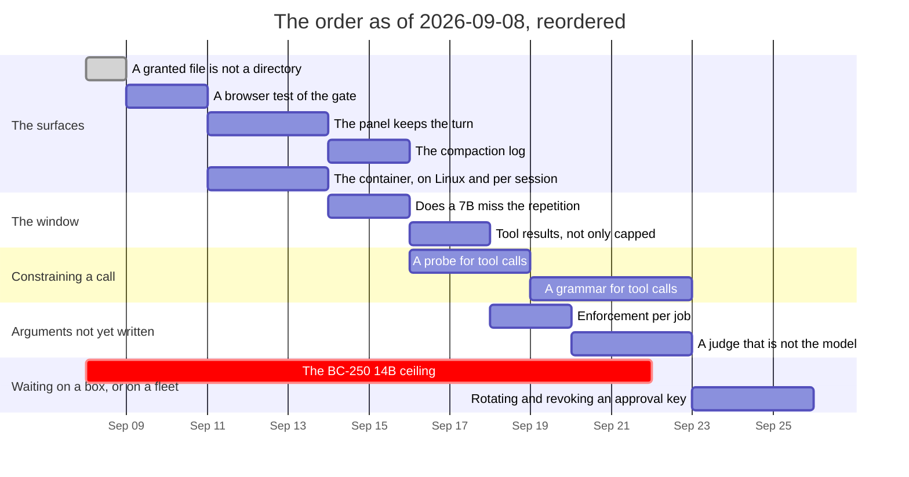

# Roadmap — revision 2026-09-08

**What this is:** the order of work as it stands on this date, and what blocks
what. Not a decision and not a description of the tree — for *what is true today*
read [`luu-design.md`](../../luu-design.md), and for *why* read the dated file
in [`RECORD/`](../../RECORD/) each item links to.

**Reordered later the same day, and the reordering is the news.** The order
below the "What landed" table was rewritten after the morning's version was read
back: every row in it was a measurement, an argument or a box, and none of it was
the surfaces a person works in. What the owner wants next is the UI configuring
providers, a development panel over the activity, and the three things worth
trying today — chat against a model, the gate over commands, tool calls inside
the container. Driving those to write this order found a regression that had been
in the tree since 2026-09-05, which is now item 1 and is fixed:
[`the-surfaces-first`](../../RECORD/2026-09-08.the-surfaces-first.completed.md).
The rows the morning's order held are all still here, in their own order, behind
it — nothing was dropped, and what slips says so.

Supersedes [`ROADMAP/2026-09-05/`](../2026-09-05/) wholesale. That revision was
written to put the design's open questions in an order, and in three days **nine
of its fifteen rows closed** — seven of them by code, two by a measurement it had
ordered behind hardware it did not need. What is left is small enough to be
listed rather than sequenced, and it splits cleanly in two: **one item is the
only thing in the tree with a measured number waiting for it** (rule B, where the
91% lives), and everything else is either an argument nobody has written yet or a
box nobody has walked up to.

**The hardware wall came down.** The previous revision's item 3 held three
measurements and a note saying geography blocked them; machines 4, 5 and 6 have
each been reached since, and the only ceiling left unconfirmed in the whole
inventory is the BC-250's 14B — see [`machines.md`](machines.md).

## What landed since 2026-09-05

| | |
| --- | --- |
| **Selection at the gate** | `serve` and `stdio` take `--select-tokens`; the tree is walked once at startup and the selection is read through the **live job's** sandbox, so an approved plan narrows what may be chosen exactly as it narrows what may be opened — [`selection-at-the-gate`](../../RECORD/2026-09-06.selection-at-the-gate.completed.md) |
| **Does the model read it?** | The same 38 questions one flag apart against `qwen2.5-coder:7b`: **0 with nothing, 8 with the map, 33 with the selection**, at 91% precision on what the selector held. All three filed predictions falsified; the useful one is that position inside the bucket does not matter — [`does-the-model-read-it`](../../RECORD/2026-09-06.does-the-model-read-it.completed.md) |
| **A span is rendered once** | Rule A of item 6, off by default (`--repeat-once`): the **oldest** turn of the window keeps a repeated span, so only the newest message changes. `code` falls 19.5% on twenty grounded turns, cuts go 12 → 8, prefix reuse 34% → 52% — and the corpus it needed was four days dead, which is now a test — [`a-span-is-rendered-once`](../../RECORD/2026-09-07.a-span-is-rendered-once.completed.md) |
| **Naming a provider** | Where a model lives, written down once: `[provider.<name>]` in the state directory's `config.toml`, `-p` and `-m`, and a `default` profile that will not load pointing off the machine without `remote = true` — [`naming-a-provider`](../../RECORD/2026-09-07.naming-a-provider.completed.md) |
| **Configuring from the browser** | The modal, loopback-only, with the loader refusing the write and naming the host to type back — so the rule has one implementation and the browser never classifies a URL — [`configuring-from-the-browser`](../../RECORD/2026-09-07.configuring-from-the-browser.completed.md) |
| **The first run has no provider** | A server with nowhere to send says so, each provider lists the models it serves, and a session names the profile and model it starts on. The destination is the **session's** now, not the process's — [`the-first-run-has-no-provider`](../../RECORD/2026-09-07.the-first-run-has-no-provider.completed.md) |
| **A second header** | `resume {provider, model}` re-folds the context under the new counter and writes a second `Header` into the stream. Found while driving it: the page named the gate's job field twice and **no approval from this UI had reached the server since the rename** — [`a-second-header`](../../RECORD/2026-09-07.a-second-header.completed.md) |
| **Resolving a symbol** | Proposed and rejected the same day, and the reading that rejected it found the live bug underneath: `walk_sources` ran once per process, so an edited file stayed selectable at its *startup* line numbers. Fixed with a stamp and `rewalk_sources` — [`resolving-a-symbol`](../../RECORD/2026-09-07.resolving-a-symbol.completed.md) |
| **Three machines reached** | The 6 GB floor degrades rather than breaks; Landlock ABI v10 + seccomp hold `run_command` on native Linux with no VM and no container; the RTX's 14B ceiling is confirmed at 11.1/16.3 GB and stretched to ~49K (q8_0) / ~65K (q4_0) with quantized KV cache, no fork needed — [`the-floor-on-6gb`](../../RECORD/2026-09-08.the-floor-on-6gb.completed.md), [`landlock-holds-natively`](../../RECORD/2026-09-08.landlock-holds-natively.completed.md), [`the-rtx-holds-14b`](../../RECORD/2026-09-08.the-rtx-holds-14b.completed.md), [`the-14b-context-ceiling`](../../RECORD/2026-09-08.the-14b-context-ceiling.completed.md) |

## The order

**Section A — the surfaces, which is what is being asked for.** Argued in
[`the-surfaces-first`](../../RECORD/2026-09-08.the-surfaces-first.completed.md).

| # | Item | Blocked on | Argued in |
| --- | --- | --- | --- |
| 1 | ~**A granted file is not a directory** — a plan that names a file makes the file the job's sandbox root, and `.` beneath a regular file is `ENOTDIR`, so an approved plan could not read the one path it had just been approved for~ **fixed the day this revision was reordered, with the regression test that was missing. Found by driving the gate over the socket with the page's own messages; it is not Linux-only, and it had been in the tree since 2026-09-05** | nothing | [`the-surfaces-first`](../../RECORD/2026-09-08.the-surfaces-first.completed.md) |
| 2 | ~**A browser test of the gate, on the mock** — Playwright against a live `luu serve --mock-reply`, clicking Approve and asserting the tool ran. CI covers the static twin, which has no server behind it and therefore no gate; the only thing that drives the page through it needs a model, a server and a person watching fifteen prompts. **Two bugs in two days were found by hand there and none by a test**~ **landed: `tests/smoke/gate.spec.js` drives one whole job — prompt, gate, an amendment the plan never declared, Approve, the tool call, the fold — in a second, on the mock, in CI. It found a third bug before it passed: `record::FORMAT` went to 8 with rule B, `store.js` still said 7, the host refused every `hello`, and the UI had been unable to open a session at all since that commit** | nothing | [`a-test-that-clicks-approve`](../../RECORD/2026-09-08.a-test-that-clicks-approve.completed.md) |
| 3 | ~**The panel keeps what the turn showed** — the inspector draws the budget, prefix reuse, the tool calls with their verdict and the prompt, and resets all four at `turn_started`, so nothing in the page can look at turn 3. **No protocol work and no server work**: `GET /api/sessions/:id/turns/:n` already answers with `prompt_sent`, `budget`, `prefix`, `extra_calls`, `tools`, `dropped`, `pruned_by`, `cited` and both timestamps~ **landed: one shape per turn, a picker at the top of the inspector, history filled from the API on connect and appended to as each turn ends. The live turn is that same shape read out of the socket's own fields, which is why it is a small diff rather than a second inspector** | nothing | [`the-panel-keeps-the-turn`](../../RECORD/2026-09-08.the-panel-keeps-the-turn.completed.md) |
| 4 | ~**The compaction log** — panel 4 of the four the design says justify building this at all, and the only one never built: when a summary was written, what it replaced, what it saved. **Not the same shape as item 3, which the reading for it found**: *when* is `job_closed` and *what it replaced* is the job's turns, both already in the stream, but *what it saved* is not — `job::Summary` carries its own `tokens` and nothing carries what the turns it replaced were worth. So it wants a record and probably a fold line of its own, at a format bump, before it wants a panel~ **landed, and as an added field rather than a new line: `job_closed` carries `replaced {turns, tokens}`, counted at the close with the counter that counted the summary. Record format 9, protocol untouched at 5, and the page's constant moved with the Rust one in the same commit — which is `ui_versions.rs` from item 2 doing its job** | nothing | [`what-a-fold-writes-down`](../../RECORD/2026-09-08.what-a-fold-writes-down.completed.md) |
| 5 | **The container, from the surface and on Linux** — every contained run in this repository is Docker Desktop on macOS, and `serve` resolves **one** worker at startup that every session shares, while the design says one container per session. The page shows the resolved sandbox and cannot choose it, which is exactly where the provider was before 2026-09-07 | nothing for the Linux run — machines 4, 5 and 6 are Linux; the per-session executor wants an argument first | [`the-container-observed`](../../RECORD/2026-09-03.the-container-observed.completed.md) §Still open, [`the-surfaces-first`](../../RECORD/2026-09-08.the-surfaces-first.completed.md) §Still open |

**Section B — the measurements and arguments the morning's order held.** Same
rows, same reasoning, behind section A. The one that hurts is item 6: it was
correctly called the cheapest unbought answer in the project, and it now waits.

| # | Item | Blocked on | Argued in |
| --- | --- | --- | --- |
| — | ~**Prune behind (rule B)**~ **landed 2026-09-08, off by default (`--prune-behind`). The saving is not the one the row predicted: −0.3% of prompt tokens and *nothing evicted* — 0 turns dropped against 13. There was no 91% to free; what the flag buys is what the same prompt is made of. Two findings under it: pruning is not monotone under rule A, and a recording said nothing about it until `pruned` trace lines and `record::FORMAT` 8** | nothing | [`prune-behind`](../../RECORD/2026-09-08.prune-behind.completed.md), from [`what-leaves-the-history`](../../RECORD/2026-09-06.what-leaves-the-history.completed.md) |
| 6 | **Whether a 7B misses the repetition** — `--repeat-once` one flag apart against a model. Rule A is off for two reasons and this closes the second: position inside the *bucket* does not matter, position across the *window* has never been asked | a model on a machine, which machines 1 and 4 both now are | [`a-span-is-rendered-once`](../../RECORD/2026-09-07.a-span-is-rendered-once.completed.md) §Still open |
| 7 | **A probe for tool calls** — N prompts that each require exactly one call, scored *parsed* / *drifted* / *no call* / **continued past the fence**, the fourth being what the precision run found by accident and no existing probe counts | nothing; item 8 is a sentence without it | [`a-grammar-for-tool-calls`](../../RECORD/2026-09-06.a-grammar-for-tool-calls.WIP.md) §The instrument |
| 8 | **A grammar for tool calls** — the parse reads the block correctly; what fails is that generation does not stop. Narrowed to tool calls alone, the plan block stays as it is | item 7, and the **first move is one curl**: whether `/v1/chat/completions` takes a bare `grammar` field decides whether this costs a chat template or a branch | [`a-grammar-for-tool-calls`](../../RECORD/2026-09-06.a-grammar-for-tool-calls.WIP.md) |
| 9 | **Tool results are only capped** — an 8 KiB `cat` and a 1 000-token fragment are the same object to the window, and neither `Repeat` nor rule B reaches `ToolStep` today. Unblocked: the shape rule B settled on — a ratchet, a citation, and the eviction policy's own target — is the one a tool result would reuse | nothing | [`what-leaves-the-history`](../../RECORD/2026-09-06.what-leaves-the-history.completed.md) §Still open |
| 10 | **Enforcement per job** — `network` and `egress` narrow per job; `enforcement` is still session-wide. **Ordered since 2026-09-05 and still unargued**: the next move on it is a record, not a diff | nothing | `luu-design.md` §Open questions |
| 11 | **A judge that is not the model under test** — every probe in this repository is scored by a key on disk or by a person reading replies. Scoring at corpus scale wants a judge, and a judge wants an argument before it wants an endpoint | needs a design argument | [`machines.md`](machines.md) P1 |
| 12 | **The BC-250's 14B ceiling** — ~9.4 GiB usable against a 14B Q4; the last unconfirmed ceiling in the inventory, and the only row left that needs a box | hardware and a hand on it | [`machines.md`](machines.md), from [`the-bc250-run`](../../RECORD/2026-09-04.the-bc250-run.completed.md) |
| 13 | **Rotating and revoking an approval key** — a compromised key is removed by editing `luu.toml` and restarting. Also: nothing signs a *recording*, so a reader that dropped lines is not detected | waits on a fleet being more than the boxes in one room | [`signed-approvals`](../../RECORD/2026-09-04.signed-approvals.completed.md) §Still open |

## What actually blocks what

- **Item 1 was not on any roadmap, and it is the reason this one moved.** It was
  found in the first ten minutes of driving the gate over the socket with the
  page's own messages: the plan granted `AGENTS.md`, the gate approved it, and
  the read of that exact file came back `Not a directory (os error 20)`. One flag
  apart — the same run with a plan granting a directory — was clean and held by
  the kernel. Every test in the tree that opens a file does it under a directory
  grant, so nothing caught it for three days.
- **Item 2 landed and immediately paid for itself.** It cost one spec, one
  config and a `make smoke`, it runs in a second on the mock, and the first time
  it was run it found that the page could not open a session at all: `FORMAT`
  drifted to 8 in the Rust and stayed 7 in the browser, so the host refused
  every `hello` the page sent. Three bugs in three days, all in the half of the
  UI that acts, and this is the first one a test found. `cargo test` now also
  asserts the two constants against each other
  ([`ui_versions.rs`](../../crates/luu/tests/ui_versions.rs)), because that
  check is free and belongs where the person bumping the number already is.
- **Item 3 landed, and the decision it turned on was the second one.** The live
  turn is not a special case of the history: it is the same six fields read out
  of the store the socket fills, so `panel()` returns one shape and every
  binding in the inspector reads it. The API half was free — the page already
  fetched `/api/sessions/live` to build the transcript and dropped everything
  but `prompt`, `text` and `usage` on the floor. Both halves are asserted in the
  browser: from the stream without a reload, and from the API after one.
- **Item 4 was two thirds a page and one third a number nobody recorded**, and
  the third decided its shape: what the fold saved cannot be recovered after the
  close — the window moves, a resume can change the counter, and eviction may
  take the same turns — so it is counted there or not at all. It landed as a
  field on `job_closed` rather than a line of its own, because a new variant is
  the one change an older reader chokes on rather than skips. The format bump it
  cost (9) is also the first exercise of `ui_versions.rs`: the two constants
  moved together in the same commit, which is the failure this morning's outage
  was.
- **Item 5 splits in two and only half of it is code.** *Build the image on Linux
  and run a session in it* is an afternoon on machine 4, and it closes the last
  claim in the design that rests on one platform. *A session picks its executor*
  is the same argument the provider had on 2026-09-07 — the answer there was that
  the choice is the session's and the moment is when it starts — and it should be
  written before it is built.
- **Item 6 is what this reordering costs.** The flag exists, the corpus exists,
  the model is on machine 1 and on machine 4, and rule A stays off in the
  meantime for a reason nobody has measured. It is one afternoon, and it is now
  behind four rows of UI work. That is the trade, stated where it can be argued
  with rather than discovered later.
- **Items 7 and 8 keep their order and lose their start date.** The probe before
  the grammar, the curl before either — nothing about the reordering touches
  that, and the previous revision's argument for it stands as written.
- **Item 10 has been on four revisions and has never been argued.** That is still
  the finding. The honest guess is unchanged: a plan may only ever narrow, and
  "narrow" is not obviously defined on a scale.
- **Item 12 is the last row this project can call blocked by geography**, and it
  is the only one in section B that section A cannot delay: a box is a box.
