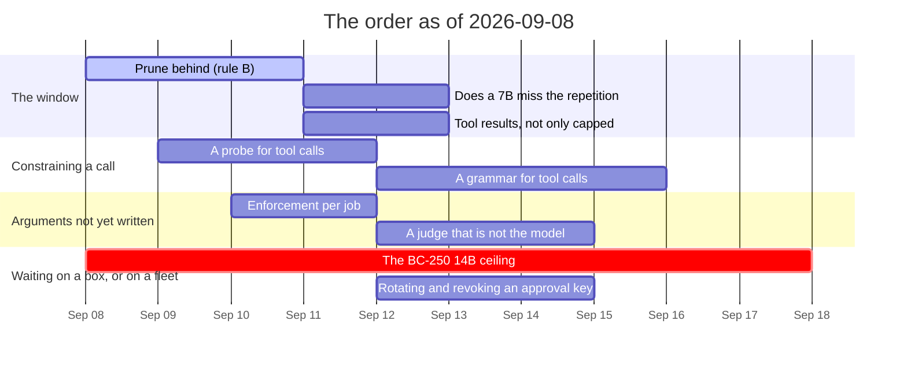

# Roadmap — revision 2026-09-08

**What this is:** the order of work as it stands on this date, and what blocks
what. Not a decision and not a description of the tree — for *what is true today*
read [`luu-design.md`](../../luu-design.md), and for *why* read the dated file
in [`RECORD/`](../../RECORD/) each item links to.

Supersedes [`ROADMAP/2026-09-05/`](../2026-09-05/) wholesale. That revision was
written to put the design's open questions in an order, and in three days **nine
of its fifteen rows closed** — seven of them by code, two by a measurement it had
ordered behind hardware it did not need. What is left is small enough to be
listed rather than sequenced, and it splits cleanly in two: **one item is the
only thing in the tree with a measured number waiting for it** (rule B, where the
91% lives), and everything else is either an argument nobody has written yet or a
box nobody has walked up to.

**The hardware wall came down.** The previous revision's item 3 held three
measurements and a note saying geography blocked them; machines 4, 5 and 6 have
each been reached since, and the only ceiling left unconfirmed in the whole
inventory is the BC-250's 14B — see [`machines.md`](machines.md).

## What landed since 2026-09-05

| | |
| --- | --- |
| **Selection at the gate** | `serve` and `stdio` take `--select-tokens`; the tree is walked once at startup and the selection is read through the **live job's** sandbox, so an approved plan narrows what may be chosen exactly as it narrows what may be opened — [`selection-at-the-gate`](../../RECORD/2026-09-06.selection-at-the-gate.completed.md) |
| **Does the model read it?** | The same 38 questions one flag apart against `qwen2.5-coder:7b`: **0 with nothing, 8 with the map, 33 with the selection**, at 91% precision on what the selector held. All three filed predictions falsified; the useful one is that position inside the bucket does not matter — [`does-the-model-read-it`](../../RECORD/2026-09-06.does-the-model-read-it.completed.md) |
| **A span is rendered once** | Rule A of item 6, off by default (`--repeat-once`): the **oldest** turn of the window keeps a repeated span, so only the newest message changes. `code` falls 19.5% on twenty grounded turns, cuts go 12 → 8, prefix reuse 34% → 52% — and the corpus it needed was four days dead, which is now a test — [`a-span-is-rendered-once`](../../RECORD/2026-09-07.a-span-is-rendered-once.completed.md) |
| **Naming a provider** | Where a model lives, written down once: `[provider.<name>]` in the state directory's `config.toml`, `-p` and `-m`, and a `default` profile that will not load pointing off the machine without `remote = true` — [`naming-a-provider`](../../RECORD/2026-09-07.naming-a-provider.completed.md) |
| **Configuring from the browser** | The modal, loopback-only, with the loader refusing the write and naming the host to type back — so the rule has one implementation and the browser never classifies a URL — [`configuring-from-the-browser`](../../RECORD/2026-09-07.configuring-from-the-browser.completed.md) |
| **The first run has no provider** | A server with nowhere to send says so, each provider lists the models it serves, and a session names the profile and model it starts on. The destination is the **session's** now, not the process's — [`the-first-run-has-no-provider`](../../RECORD/2026-09-07.the-first-run-has-no-provider.completed.md) |
| **A second header** | `resume {provider, model}` re-folds the context under the new counter and writes a second `Header` into the stream. Found while driving it: the page named the gate's job field twice and **no approval from this UI had reached the server since the rename** — [`a-second-header`](../../RECORD/2026-09-07.a-second-header.completed.md) |
| **Resolving a symbol** | Proposed and rejected the same day, and the reading that rejected it found the live bug underneath: `walk_sources` ran once per process, so an edited file stayed selectable at its *startup* line numbers. Fixed with a stamp and `rewalk_sources` — [`resolving-a-symbol`](../../RECORD/2026-09-07.resolving-a-symbol.completed.md) |
| **Three machines reached** | The 6 GB floor degrades rather than breaks; Landlock ABI v10 + seccomp hold `run_command` on native Linux with no VM and no container; the RTX's 14B ceiling is confirmed at 11.1/16.3 GB and stretched to ~49K (q8_0) / ~65K (q4_0) with quantized KV cache, no fork needed — [`the-floor-on-6gb`](../../RECORD/2026-09-08.the-floor-on-6gb.completed.md), [`landlock-holds-natively`](../../RECORD/2026-09-08.landlock-holds-natively.completed.md), [`the-rtx-holds-14b`](../../RECORD/2026-09-08.the-rtx-holds-14b.completed.md), [`the-14b-context-ceiling`](../../RECORD/2026-09-08.the-14b-context-ceiling.completed.md) |

## The order

| # | Item | Blocked on | Argued in |
| --- | --- | --- | --- |
| 1 | **Prune behind (rule B)** — a span inside an *older* rendered turn is replaced by the line that cites it, so the conversation survives a cut that its quoted code does not. The half of item 6 where the **91%** lives, and the half that rewrites the prefix | nothing — the corpus and the flag rule A needed are built | [`prune-behind`](../../RECORD/2026-09-08.prune-behind.WIP.md), from [`what-leaves-the-history`](../../RECORD/2026-09-06.what-leaves-the-history.WIP.md) |
| 2 | **Whether a 7B misses the repetition** — `--repeat-once` one flag apart against a model. Rule A is off for two reasons and this closes the second: position inside the *bucket* does not matter, position across the *window* has never been asked | a model on a machine, which machines 1 and 4 both now are | [`a-span-is-rendered-once`](../../RECORD/2026-09-07.a-span-is-rendered-once.completed.md) §Still open |
| 3 | **A grammar for tool calls** — the parse reads the block correctly; what fails is that generation does not stop. Narrowed to tool calls alone, the plan block stays as it is | nothing, and the **first move is one curl**: whether `/v1/chat/completions` takes a bare `grammar` field decides whether this costs a chat template or a branch | [`a-grammar-for-tool-calls`](../../RECORD/2026-09-06.a-grammar-for-tool-calls.WIP.md) |
| 4 | **A probe for tool calls** — N prompts that each require exactly one call, scored *parsed* / *drifted* / *no call* / **continued past the fence**, the fourth being what the precision run found by accident and no existing probe counts | nothing; item 3 is a sentence without it | [`a-grammar-for-tool-calls`](../../RECORD/2026-09-06.a-grammar-for-tool-calls.WIP.md) §The instrument |
| 5 | **Enforcement per job** — `network` and `egress` narrow per job; `enforcement` is still session-wide. **Ordered since 2026-09-05 and still unargued**: the next move on it is a record, not a diff | nothing | `luu-design.md` §Open questions |
| 6 | **Tool results are only capped** — an 8 KiB `cat` and a 1 000-token fragment are the same object to the window, and neither `Repeat` nor rule B reaches `ToolStep` today | item 1, whose shape decides whether one rule covers both | [`what-leaves-the-history`](../../RECORD/2026-09-06.what-leaves-the-history.WIP.md) §Still open |
| 7 | **The BC-250's 14B ceiling** — ~9.4 GiB usable against a 14B Q4; the last unconfirmed ceiling in the inventory, and the only row left that needs a box | hardware and a hand on it | [`machines.md`](machines.md), from [`the-bc250-run`](../../RECORD/2026-09-04.the-bc250-run.completed.md) |
| 8 | **A judge that is not the model under test** — every probe in this repository is scored by a key on disk or by a person reading replies. Scoring at corpus scale wants a judge, and a judge wants an argument before it wants an endpoint | needs a design argument | [`machines.md`](machines.md) P1 |
| 9 | **Rotating and revoking an approval key** — a compromised key is removed by editing `luu.toml` and restarting. Also: nothing signs a *recording*, so a reader that dropped lines is not detected | waits on a fleet being more than the boxes in one room | [`signed-approvals`](../../RECORD/2026-09-04.signed-approvals.completed.md) §Still open |

## What actually blocks what

- **Item 1 is first because it is the only row with a number already waiting for
  it.** Rule A was ordered ahead of B because it cannot rewrite the cached
  prefix, and it paid what it was predicted to pay: 19.5% off the `code` bucket
  on the grounded corpus. B is the other 90% of the history block, and it is a
  different bet — a deep, infrequent rewrite, the same trade `Eviction::Block`
  already had to prove separately against the shallow one. Nothing else in the
  tree is waiting on it, and it needs no hardware: the corpus is fixed, the flag
  discipline is in place, and the mock backend can show the shape before a model
  is asked whether it minds.
- **Item 2 is the cheapest unbought answer in the project.** The flag exists,
  the corpus exists, the model is on the machine, and until it runs, rule A is
  off for a reason that was never measured — *the model may need the
  repetition*. It is one flag apart against `qwen2.5-coder:7b`, and it is the
  same shape as `does-the-model-read-it`, which is the run this repository
  learned the most from.
- **Item 3 cannot be scheduled ahead of item 4, and it was.** The previous
  revision ordered the grammar at four days and never noticed that the claim it
  would produce — *the grammar helps* — has no instrument behind it. Coverage
  had `map-order-probe.key` before it had a result, and precision had the same
  corpus one flag apart. A grammar arm with nothing counting *drifted* against
  *continued past the fence* would be the first claim here that could not be
  argued with. So: probe, then grammar, and the curl before either, because the
  answer to it decides whether the grammar arm costs a chat template.
- **Item 5 has been on three revisions and has never been argued.** That is
  itself the finding. `network` and `egress` were narrowed per job because a
  plan says what a job may reach; `enforcement` is a *level*, not a resource,
  and nobody has written down whether a plan is allowed to lower it, raise it,
  or neither. Two of the last three items to reach a record came back changed by
  the writing of it (item 4 lost the plan block, item 6 grew the fragment half),
  and this one is unusually likely to: the honest guess is that a plan may only
  ever narrow, and that "narrow" is not obviously defined on a scale.
- **Item 7 is the last row this project can call blocked by geography.** Five of
  the six local machines have been reached, and the two the previous revision
  was most unsure about — the 6 GB floor and native confinement without a VM —
  both came back with the answer the design hoped for and neither came back with
  the number it guessed. What remains is one ceiling on one board.
- **Item 8 is the constraint nobody has hit yet and everybody will.** Every
  number in `RECORD/` was produced by a key on disk (38 questions), a person
  reading 38 replies, or a person reading 15. Item 4's probe is the first one
  whose scoring is *four-way and per reply*, and the first where a human scorer
  is the bottleneck rather than a formality. It needs the argument before it
  needs the endpoint, because a judge that is the model under test is not a
  measurement.
