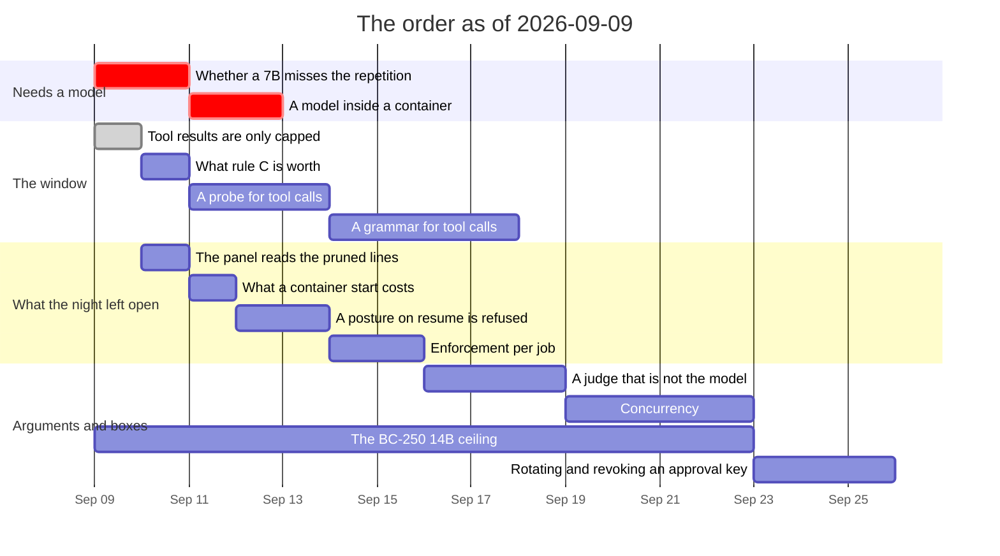

# Roadmap — revision 2026-09-09

**What this is:** the order of work as it stands on this date, and what blocks
what. Not a decision and not a description of the tree — for *what is true today*
read [`luu-design.md`](../../luu-design.md), and for *why* read the dated file
in [`RECORD/`](../../RECORD/) each item links to.

Supersedes [`ROADMAP/2026-09-08`](../2026-09-08/) wholesale, and it is the
shortest supersession this project has had: that revision was reordered inside
its own day around the surfaces a person works in, **all five rows of its
section A closed within the day**, and what is left of it is section B, untouched
and unreordered. This revision is that section, made into an order of its own,
plus the six things one night of driving those surfaces left open — gathered in
[`RECORD/2026-09-09.state-of-play.completed.md`](../../RECORD/2026-09-09.state-of-play.completed.md),
which is the file to read before this one.

**The finding this revision inherits, and the reason its first row is where it
is.** Three bugs were found on 2026-09-08 and none of them was found by a test:
a plan that granted a file could not read it, the page could not open a session
at all, and a posture's name vanished when it was `null`. All three were found by
*driving the thing* — and the two rows below that need a model are the same
shape of unbought answer, one afternoon each, waiting on a box rather than on a
design.

**What has not moved is what hurts.** Item 1 was called the cheapest unbought
answer in the project on 2026-09-06, was ordered behind four rows of UI work on
2026-09-08, and is still unbought on 2026-09-09. `--repeat-once` is off by
default for two reasons; one of them was measured and the other has never been
asked. It stays at the top of this order until a machine answers it.

## What landed since 2026-09-08

| | |
| --- | --- |
| **A granted file is not a directory** | `PathCheck::beneath` resolves a root asked for by its own name as its last component — a regression in the tree since 2026-09-05, on every platform, at the gate — [`the-surfaces-first`](../../RECORD/2026-09-08.the-surfaces-first.completed.md) |
| **A browser test of the gate** | `tests/smoke/gate.spec.js` drives one whole job on the mock in a second, in CI; it found that `record::FORMAT` had drifted to 8 in Rust and stayed 7 in the browser, so the page could not open a session at all — [`a-test-that-clicks-approve`](../../RECORD/2026-09-08.a-test-that-clicks-approve.completed.md) |
| **The panel keeps the turn** | One shape per turn, a picker in the inspector, history from the API on connect and appended as each turn ends — [`the-panel-keeps-the-turn`](../../RECORD/2026-09-08.the-panel-keeps-the-turn.completed.md) |
| **The compaction log** | `job_closed` carries `replaced {turns, tokens, summary_tokens}`, counted at the close with the counter that counted the summary. Record format 9 — [`what-a-fold-writes-down`](../../RECORD/2026-09-08.what-a-fold-writes-down.completed.md) |
| **The container, on Linux and from the surface** | `scripts/container-check.sh` and the `container` job hold Landlock ABI v7 + seccomp inside stock Docker on a runner; `[posture.<name>]` in `config.toml`, a picker in the starter dialog, record format 10 — [`the-container-on-a-runner`](../../RECORD/2026-09-08.the-container-on-a-runner.completed.md), [`a-session-picks-its-executor`](../../RECORD/2026-09-08.a-session-picks-its-executor.completed.md) |
| **Prune behind (rule B)** | Landed 2026-09-08, off by default. The saving is not the one predicted: −0.3% of prompt tokens and **nothing evicted** — 0 turns dropped against 13. What the flag buys is what the same prompt is made of — [`prune-behind`](../../RECORD/2026-09-08.prune-behind.completed.md) |

## The order

**Section A — the two afternoons that need a model.** Neither is a design
question; both are a box, a flag and a corpus that already exist.

| # | Item | Blocked on | Argued in |
| --- | --- | --- | --- |
| 1 | **Whether a 7B misses the repetition** — `--repeat-once` one flag apart against a model. Rule A is off for two reasons and this closes the second: position inside the *bucket* does not matter, position across the *window* has never been asked. **One revision late** | an afternoon on machine 1 or 4 | [`a-span-is-rendered-once`](../../RECORD/2026-09-07.a-span-is-rendered-once.completed.md) §Still open |
| 2 | **A model inside a container** — every contained run in this repository, on the Mac and on the runner, is the mock. The trigger `luu.container.toml` names for narrowing its network is the first `run_command` inside one with a model in the loop, and nothing has ever exercised it | machine 4, which is the only box that is both Linux and a model | [`a-session-picks-its-executor`](../../RECORD/2026-09-08.a-session-picks-its-executor.completed.md) §Still open |

**Section B — the window, which is where the code is.**

| # | Item | Blocked on | Argued in |
| --- | --- | --- | --- |
| 3 | ~**Tool results are only capped** — an 8 KiB `cat` and a 1 000-token fragment are the same object to the window, and neither `Repeat` nor rule B reaches `ToolStep` today. The shape rule B settled on — a ratchet, a citation, and the eviction policy's own target — is the one a tool result reuses, so this is the cheapest row in the revision~ **landed the day this revision was written, as rule C: `--prune-results`, off, and inert without `--prune-behind`. It reaches the case rule B cannot — a turn that ran a tool and selected nothing has no spans to give — and it has no number: nothing has been run one flag apart, which is now the row below.** Found under it: `job_closed`'s `replaced.tokens` had been over-reporting a pruned turn since rule B landed on 2026-09-08, counting what its turns were *stored* at rather than what the prompt they left was made of. Fixed in the same commit | nothing | [`what-a-result-costs`](../../RECORD/2026-09-09.what-a-result-costs.completed.md), from [`what-leaves-the-history`](../../RECORD/2026-09-06.what-leaves-the-history.completed.md) §Still open |
| 3b | **What rule C is worth** — `--prune-results` one flag apart, the way `--repeat-once` and `--prune-behind` were both measured. The rule the tests describe is *the prompt is smaller and the conversation is intact*; how much smaller is unmeasured, and a rule built without a run is the thing item 1 is a warning about. **It needs a corpus that does not exist**: `--mock-reply` is consumed one per model *call* with the last repeating, so a twenty-turn script on the mock runs a tool exactly once and the grounded corpus has no tool output in it at all. A mock that answers with a call per turn is the missing instrument — **and it is the same instrument item 4 needs**, which is the reason to build it once | a mock that can call a tool every turn | [`what-a-result-costs`](../../RECORD/2026-09-09.what-a-result-costs.completed.md) §Still open |
| 4 | **A probe for tool calls** — N prompts that each require exactly one call, scored *parsed* / *drifted* / *no call* / **continued past the fence**, the fourth being what the precision run found by accident and no existing probe counts. **The instrument is writable without a model**; only running it is section A's kind of work | nothing for the harness; a model to run it | [`a-grammar-for-tool-calls`](../../RECORD/2026-09-06.a-grammar-for-tool-calls.WIP.md) §The instrument |
| 5 | **A grammar for tool calls** — the parse reads the block correctly; what fails is that generation does not stop. Narrowed to tool calls alone, the plan block stays as it is | item 4, and the **first move is one curl**: whether `/v1/chat/completions` takes a bare `grammar` field decides whether this costs a chat template or a branch | [`a-grammar-for-tool-calls`](../../RECORD/2026-09-06.a-grammar-for-tool-calls.WIP.md) |

**Section C — what the night left open.** Five rows, none of them ordered
before, all of them from
[`state-of-play`](../../RECORD/2026-09-09.state-of-play.completed.md) §Still
open. They are small, and being small is exactly why they need a line in a plan
rather than a sentence in a record nobody re-reads.

| # | Item | Blocked on | Argued in |
| --- | --- | --- | --- |
| 6 | **Nothing in the page reads the trace's `pruned` lines** — `/ws/trace` has a consumer for `prompt`, `prefix_reuse`, `budget` and `step_call`, and none for the lines rule B added. The panel exists to watch the window give way, and the one rule that makes it give way without losing a turn is invisible in it | nothing | [`prune-behind`](../../RECORD/2026-09-08.prune-behind.completed.md) |
| 7 | **What a container start costs** — *the worker starts with the session* was chosen on the shape of the thing and not on a number. The `container` job already makes the same call on both sides and is where the number comes from | nothing | [`a-session-picks-its-executor`](../../RECORD/2026-09-08.a-session-picks-its-executor.completed.md) §Still open |
| 8 | **A session resumed under a different posture is refused by nothing** — it is visible in the header and enforced nowhere. The store keeps jobs and their approved plans; it does not keep what they were approved *under*, so an approval granted inside a container can be replayed on the host | nothing; wants a record first | [`a-session-picks-its-executor`](../../RECORD/2026-09-08.a-session-picks-its-executor.completed.md) §Still open |
| 9 | **Enforcement per job** — `network` and `egress` narrow per job; `enforcement` is still session-wide. **Ordered since 2026-09-05 and still unargued**: the next move on it is a record, not a diff. The honest guess is unchanged — a plan may only ever narrow, and "narrow" is not obviously defined on a scale | nothing; wants a record first | `luu-design.md` §Open questions |
| 10 | **Nothing counts how often a plan grants a file rather than a directory**, which is the number that would say how ordinary the 2026-09-08 regression was — and therefore how much of the gate's surface has no test | nothing | [`the-surfaces-first`](../../RECORD/2026-09-08.the-surfaces-first.completed.md) |

**Section D — arguments, boxes and one thing that is not designed.**

| # | Item | Blocked on | Argued in |
| --- | --- | --- | --- |
| 11 | **A judge that is not the model under test** — every probe in this repository is scored by a key on disk or by a person reading replies. Scoring at corpus scale wants a judge, and a judge wants an argument before it wants an endpoint | needs a design argument | [`machines.md`](machines.md) P1 |
| 12 | **Concurrency** — `serve` runs one live session at a time; sessions are switched, not run side by side. A per-session `Agency` is the first half of what it would need and the rest is not designed. **Newly ordered, and the only row here that is a shape rather than a task** | needs a design argument | [`state-of-play`](../../RECORD/2026-09-09.state-of-play.completed.md) §Still open |
| 13 | **The BC-250's 14B ceiling** — ~9.4 GiB usable against a 14B Q4; the last unconfirmed ceiling in the inventory, and the only row in this revision that needs a box nobody has a hand on. The interesting half is whether the `-ctk`/`-ctv` trick that moved machine 4's ceiling pays on RADV/Vulkan | hardware and a hand on it | [`machines.md`](machines.md), from [`the-bc250-run`](../../RECORD/2026-09-04.the-bc250-run.completed.md) |
| 14 | **Rotating and revoking an approval key** — a compromised key is removed by editing `luu.toml` and restarting. Also: nothing signs a *recording*, so a reader that dropped lines is not detected | waits on a fleet being more than the boxes in one room | [`signed-approvals`](../../RECORD/2026-09-04.signed-approvals.completed.md) §Still open |

## What actually blocks what

- **Item 1 blocks nothing and is first anyway.** Nothing in the tree waits on
  the answer: rule A is built, it is off, and it stays off either way until
  somebody runs it. What it blocks is the *decision* — whether the default
  changes — and a rule that is built, measured on tokens and never measured on
  answers is the most expensive kind of unfinished work this project produces,
  because it looks finished. Two revisions have now ordered it and neither has
  bought it.
- **Item 3 landed the day this revision was written, and item 3b is what it
  cost.** The rule is built, off, tested and unmeasured — which is precisely the
  shape item 1 is at the top of this order for. It is one mock run on a corpus
  that already exists, and it should not be allowed to become a second row that
  looks finished.
- **Item 3 is the last row of the window's original argument.**
  [`what-leaves-the-history`](../../RECORD/2026-09-06.what-leaves-the-history.completed.md)
  proposed two rules and left a third case open in its §Still open — *tool
  results and fragments may not want the same rule* — and this is that case,
  answered rather than assumed: they want the same *line* and a different
  citation. It needs no model, no box and no format bump, which is why it is
  ahead of everything in sections C and D.
- **Items 3b and 4 want the same thing built first.** Neither can be run on the
  mock as it stands: replies are consumed per model call with the last
  repeating, so nothing on this machine can make a corpus where a tool is called
  every turn. That instrument is one change to the mock, it unblocks a
  measurement and a probe at once, and whoever picks up either row should build
  it rather than working around it twice.
- **Items 4 and 5 keep their order and their first move.** The probe before the
  grammar, the curl before either. What the reordering of 2026-09-08 changed is
  that the probe's *harness* is now visibly separable from the probe's *run* —
  the harness is section B work and the run is section A work — and splitting
  them is what stops the whole pair waiting on a box.
- **Item 6 is the smallest row here and the one that would have found the most.**
  Three of the three bugs of 2026-09-08 were found by watching the surface act.
  A rule whose whole effect is invisible in the panel is a rule nobody will
  notice going wrong.
- **Items 8 and 9 are both a record before they are a diff, and they are the
  same record's neighbourhood**: what an approval was granted under, and what a
  job may narrow. Whoever writes one should read the other first — that is a
  suggestion about sequencing and not a claim that they are one item.
- **Item 12 is ordered here for the first time and is deliberately last of the
  arguments.** `serve` running one session at a time has not cost anything yet
  because nothing has asked for two. The row exists so that the first thing to
  ask for two does not discover that the shape was never designed.
- **Item 13 is the only row this project can still call blocked by geography**,
  and the only one in the revision that no amount of work here can advance.
