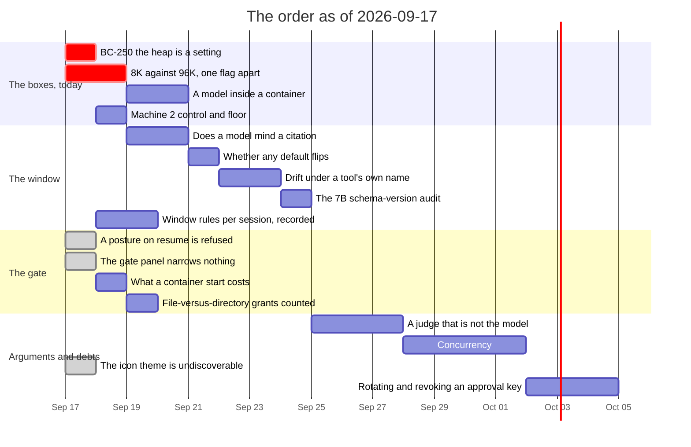

# Roadmap — revision 2026-09-17

**What this is:** the order of work as it stands on this date, and what blocks
what. Not a decision and not a description of the tree — for *what is true today*
read [`luu-design.md`](../../luu-design.md), and for *why* read the dated file
in [`RECORD/`](../../RECORD/) each item links to.

Supersedes [`ROADMAP/2026-09-09`](../2026-09-09/) wholesale. Eight days, and
**seven of its fifteen rows closed** — items 1, 3, 3b, 4, 5, 6 and 9 are struck
through in place there, 3b being the row that revision grew during its own day.
What is left of it is items 2, 7, 8, 10, 11, 12, 13 and 14, and one of those (13, the BC-250's ceiling) stopped being blocked
by geography while nobody was looking: it now has a protocol, in a record written
the night before this file.

**The calibration finding, and it is the reason this revision exists rather than
a reorder of the last one.** Of the thirty-three commits since 2026-09-09,
**roughly a dozen are debug-UI work that no roadmap row ever asked for** — three
panes, a preferences menu, a file tree, a git panel, icons, highlighting, drawn
symbols, a folder picker, a viewer rewritten twice and measured against Monaco.
It is good work and it is recorded properly; what it is not is *planned*. A
roadmap that only lists what it predicted is a roadmap that flatters itself, so
that fortnight gets a section of its own below, marked as what it was: the thing
that actually happened.

**What this revision's own day did to it** is gathered in
[`RECORD/2026-09-17.state-of-play.completed.md`](../../RECORD/2026-09-17.state-of-play.completed.md),
written after it: item 9 closed, record and diff together, and the housekeeping
that produced this file is what found the work. **Items 10 and 15 closed the
same day, after it** — the gate panel that could narrow nothing, and the icon
theme the page never mentioned — in
[`RECORD/2026-09-17.the-gate-panel-narrows.completed.md`](../../RECORD/2026-09-17.the-gate-panel-narrows.completed.md).
Three of this revision's sixteen rows are struck through on the day it was
written, which says more about how they were estimated than about the day.

**The one row that expires.** Section A is the only section here with a clock on
it. [`the-16gb-threshold`](../../RECORD/2026-09-16.the-16gb-threshold.WIP.md) was
written the night of 2026-09-16 specifically so that *the machines are available
the morning of 2026-09-17* would not be spent deciding what to type. It is the
only record in the tree that names a date it is waiting for, and that date is
today.

## What landed since 2026-09-09

| | |
| --- | --- |
| **Rule C, and what it is worth** | `--prune-results` landed the day the last revision was written; measured 2026-09-14 on the mock with `--mock-cycle`: 32 752 tokens freed over 20 turns and **eviction eliminated outright** — 16/20 turns evicted whole without it, 0 with it — [`what-a-result-costs`](../../RECORD/2026-09-09.what-a-result-costs.completed.md), [`what-rule-c-is-worth`](../../RECORD/2026-09-14.what-rule-c-is-worth.completed.md) |
| **Rule A, answered by a model** | `--repeat-once` against `qwen2.5-coder:7b`, verdict-for-verdict identical to `off` across all 20 questions of `grounded.txt` while the `code` bucket fell 17.5% — [`the-7b-does-not-miss-it`](../../RECORD/2026-09-14.the-7b-does-not-miss-it.completed.md) |
| **A tool called every turn, without a model** | `--mock-cycle` wraps the reply queue instead of sticking on its last element, which is what unblocked both measurements above — [`a-call-every-turn`](../../RECORD/2026-09-14.a-call-every-turn.completed.md) |
| **The tool-call probe, harness and runs** | `score_call`, fifteen prompts, four verdicts; 20% clean on the 7B, 80% on the 14B, and more than half the no-calls were the model answering confidently wrong rather than declining — [`the-tool-call-probe`](../../RECORD/2026-09-14.the-tool-call-probe.completed.md), [`the-tool-call-probe-run`](../../RECORD/2026-09-14.the-tool-call-probe-run.completed.md) |
| **`--constrain`, both arms, then the retry it was always meant to be** | `grammar` 7/15 against 3/15 and fence-continuation gone; `schema` applied to a whole turn answers **0/15**, and applied as a one-shot retry on a `Drifted` verdict recovers 6/6 — plus `--constrain` on `serve` and `stdio`, and `TurnEvent::ConstraintRefused` so a refused retry stops being silent — [`a-grammar-for-tool-calls`](../../RECORD/2026-09-06.a-grammar-for-tool-calls.completed.md), [`what-constrain-does`](../../RECORD/2026-09-14.what-constrain-does.completed.md), [`the-bare-grammar-field`](../../RECORD/2026-09-14.the-bare-grammar-field.completed.md), [`the-alternation-that-was-not-one`](../../RECORD/2026-09-14.the-alternation-that-was-not-one.completed.md) |
| **`run_command`'s argv, and that the drift was never the backend** | One array instead of `command` + `args` closes the envelope collapse (0/24 on a follow-up run), the fix generalizes to `edit_file` and `write_file` 8/8, and a backend difference that had been read as a backend difference turned out to be two files sharing a model name — [`does-the-envelope-collapse-generalize`](../../RECORD/2026-09-15.does-the-envelope-collapse-generalize.completed.md), [`the-drift-was-never-the-backend`](../../RECORD/2026-09-15.the-drift-was-never-the-backend.completed.md) |
| **Quantized KV costs no measurable precision on the 14B** | Identical 30/34 across `f16`/`q8_0`/`q4_0`, the same four questions wrong every time — appended to [`the-14b-context-ceiling`](../../RECORD/2026-09-08.the-14b-context-ceiling.completed.md) |
| **Enforcement per job** (item 9) | Ordered since 2026-09-05, unargued for eleven days, and the guess held backwards: `enforcement` is a *strictness*, not a grant, so a plan asking for `kernel` needs no permission and one asking for `best-effort` inside a `kernel` session is refused at the gate. `limits` is now the last field a plan cannot narrow — [`enforcement-per-job`](../../RECORD/2026-09-06.enforcement-per-job.completed.md) |
| **The panel reads the pruned lines** (item 6) | The smallest row of the last revision and the one that found the most: two neighbouring bugs — a cut at turn 5 shown under turn 8's budget, and a resumed session throwing away every eviction mark the API was already answering with — plus the first fixture in the tree with a `pruned` line in it — [`the-panel-reads-the-pruned-lines`](../../RECORD/2026-09-16.the-panel-reads-the-pruned-lines.completed.md) |
| **The 16GB threshold, argued and not yet run** | An external article read in full, and two machines this project labels 16 GB that are not the same sixteen. Its finding about our own tree: the BC-250's 9.4 GiB is **a setting, not a board-level carve-out** — [`the-16gb-threshold`](../../RECORD/2026-09-16.the-16gb-threshold.WIP.md) |

### And the fortnight nobody ordered: the debug UI

One conversation, eight phases, twelve commits, and not a single roadmap row. It
is listed here rather than in the order because it is **done**, and because a
revision that leaves it out cannot be used to judge how much of this project's
work the roadmap actually predicts.

| | |
| --- | --- |
| **The layout** | Three columns each with a head and a foot, one tab per open thing, a chat that names its session, a two-column collapse below 1260px, and a folder picker whose ceiling is the directory `serve` started in — [`a-three-pane-inspector`](../../RECORD/2026-09-15.a-three-pane-inspector.completed.md), [`three-columns-that-each-have-a-footer`](../../RECORD/2026-09-16.three-columns-that-each-have-a-footer.completed.md) |
| **What it shows** | A file tree and a git panel off four read-only workspace routes, VSCode icons from a theme named in `config.toml` with nothing vendored, tree-sitter highlighting server-side, seven symbols drawn rather than typed — [`the-tree-makes-room-for-an-icon`](../../RECORD/2026-09-16.the-tree-makes-room-for-an-icon.completed.md) |
| **What it does not need** | Monaco measured rather than argued and left optional; a WebSocket for the panels and a PWA both declined, with the reason written down — [`what-the-debug-ui-does-not-need`](../../RECORD/2026-09-16.what-the-debug-ui-does-not-need.completed.md), [`the-viewer-in-plain-js`](../../RECORD/2026-09-16.the-viewer-in-plain-js.completed.md) |
| **The housekeeping** | Every component's styles scoped to it and the shared layer named as one; the modals are `<dialog>` — [`styles-that-stay-in-their-component`](../../RECORD/2026-09-16.styles-that-stay-in-their-component.completed.md), [`the-modals-are-dialogs`](../../RECORD/2026-09-16.the-modals-are-dialogs.completed.md) |
| **And one bug that was never about the UI** | Every `git` call in the tree had been exiting 128 because git could not open `/dev/null` — found from the panel, fixed under it — [`git-could-not-open-dev-null`](../../RECORD/2026-09-15.git-could-not-open-dev-null.completed.md) |

## The order

**Section A — the boxes, and this is the section with a date on it.** Four runs
whose protocol is already written; none of them is a design question and none of
them can be advanced from a checkout.

| # | Item | Blocked on | Argued in |
| --- | --- | --- | --- |
| 1 | **The BC-250's heap is a setting** — `amdgpu.gttsize=12288` and a reboot, then whether `ggml-vulkan` will actually *use* the heap it was given rather than insisting on `DEVICE_LOCAL`. **This is the old item 13 and it is no longer blocked by geography**: the question stopped being *what is the board's ceiling* and became *where is its line drawn*, which a kernel parameter answers. A bigger number from `--list-devices` is not the same as a bigger model loading, and the run exists to keep the two apart | machine 6, and a reboot | [`the-16gb-threshold`](../../RECORD/2026-09-16.the-16gb-threshold.WIP.md) §1–2, from [`the-bc250-run`](../../RECORD/2026-09-04.the-bc250-run.completed.md) |
| 2 | **8K against 96K, one flag apart** — the run this project has never been able to make, because until now the window was the machine's. One `llama-server` at `-c 98304` makes it `luu`'s own `--context-limit`, and the three outcomes are named before looking: 96K wins and the differentiator owes an argument it does not have; they tie and the claim survives its first local test; 8K wins and wants a second corpus before anyone believes it | machine 4, after run 3 says the 27B fits | [`the-16gb-threshold`](../../RECORD/2026-09-16.the-16gb-threshold.WIP.md) §3–5 |
| 3 | **A model inside a container** — every contained run in this repository, on the Mac and on the runner, is the mock. The trigger `luu.container.toml` names for narrowing its network is the first `run_command` inside one with a model in the loop, and nothing has ever exercised it. **Carried unchanged from the last revision, where it was item 2 and did not move** | machine 4, which is the only box that is both Linux and a model | [`a-session-picks-its-executor`](../../RECORD/2026-09-08.a-session-picks-its-executor.completed.md) §Still open |
| 4 | **Machine 2 earns its first question** — a Metal control for RADV's doubt, and the bandwidth floor at 120 GB/s. It comes off Reserve for exactly these two runs, because a control and a floor are the two jobs a box earns by being redundant and slow | machine 2 | [`the-16gb-threshold`](../../RECORD/2026-09-16.the-16gb-threshold.WIP.md) §6–7 |

**Section B — the window, where every rule is now built and every one is off.**
Rules A, B and C all exist, all default to off, and **not one of them has been
measured against a model on the axis that would justify turning it on.**

| # | Item | Blocked on | Argued in |
| --- | --- | --- | --- |
| 5 | **Whether a model minds losing tool output to a citation** — rule C was measured on the mock, which can say how many tokens came back and cannot say whether the turn still worked. This is the stronger version of the question rule B left open, because a citation where `cargo test` output stood replaces evidence a job's closing condition reads | a model; the corpus and the flag exist | [`what-rule-c-is-worth`](../../RECORD/2026-09-14.what-rule-c-is-worth.completed.md) §Still open |
| 6 | **Whether any default flips** — three rules, three off switches, and one of them (rule A) has now cleared its bar: no verdict moved across 20 questions and the bucket fell 17.5%. That is a measurement, not a decision, and the decision has been sitting unmade since 2026-09-14. **It is a row rather than a sentence because a flag nobody ever turns on is a feature nobody has** | a proposal now exists; somebody has to accept it | [`the-7b-does-not-miss-it`](../../RECORD/2026-09-14.the-7b-does-not-miss-it.completed.md), answered by [`the-window-rules-are-a-session-fact`](../../RECORD/2026-09-18.the-window-rules-are-a-session-fact.WIP.md) |
| 7 | **Drift under a tool's own name** — `` ```list_dir ``, `` ```run_command ``: two of fifteen prompts, identical in the `off` and `grammar` arms, and genuinely a different trigger from the one the grammar closed. Needs `avoid_until_forced` run once per tool name, each forbidden outright rather than forced toward a completion | nothing | [`what-constrain-does`](../../RECORD/2026-09-14.what-constrain-does.completed.md) §Still open |
| 8 | **The 7B's tool-call numbers may carry the schema-version confound** the registry-vs-local comparison had, and nobody has audited them. Cheap, unglamorous, and the kind of thing that quietly invalidates a table six weeks later | nothing | [`a-grammar-for-tool-calls`](../../RECORD/2026-09-06.a-grammar-for-tool-calls.completed.md) §Still open, sixteenth update |
| 17 | **The window rules are a session's fact and nothing treats them as one** — the three rules are process-wide flags at `serve`, unreachable from any surface a person uses, and **the recording does not say which of them a run ran under**: the header carries `eviction` and not `repeat`, `prune` or `results`. Grown on 2026-09-18 out of item 6, and the recording half is a defect that lands first and stands alone | nothing | [`the-window-rules-are-a-session-fact`](../../RECORD/2026-09-18.the-window-rules-are-a-session-fact.WIP.md) |

**Section C — the gate, which is the surface with the least test per line.** Four
rows, three of them carried from the last revision where none of them moved.

| # | Item | Blocked on | Argued in |
| --- | --- | --- | --- |
| 9 | ~**A session resumed under a different posture is refused by nothing** — it is visible in the header and enforced nowhere. The store keeps jobs and their approved plans; it does not keep what they were approved *under*, so an approval granted inside a container can be replayed on the host. **First in this section, and the record is the next move rather than the diff** — the same shape item 9 of the last revision turned out to have, where the argument and the code were the same age. **The record was written the day this revision was**, and the row's own sentence turned out to be right about the symptom and wrong about the mechanism: a resume reads the posture out of the *live process*, the fold drops the posture the header already carries, and a resume that changes only the posture writes no header at all — so the **recording** is wrong as well as the gate~ **landed the same day, record and diff both.** The fold keeps `Option<record::Posture>` (no format bump — the fact has been on the wire since format 10), the resume refuses a mismatch on the three facts and admits a body naming the session's own, `retarget_header` gained its third term, and the page says the posture back so a contained session stays resumable from the only surface that resumes one. Found while building it, and it is the row's real lesson: **the test that pinned this rule could never have caught the bug** — it asserted the 409 for a *named* posture against a server built with `store: None`, so there was no stored session, no posture to compare, and the refusal it read came from a branch that fired before any of that. Third time in ten days that the defect was in the thing nothing drove | nothing | [`what-an-approval-was-granted-under`](../../RECORD/2026-09-17.what-an-approval-was-granted-under.completed.md), from [`a-session-picks-its-executor`](../../RECORD/2026-09-08.a-session-picks-its-executor.completed.md) §Still open |
| 10 | ~**The gate panel exposes none of `network`, `egress` or `enforcement`** — all three are on the protocol and reachable from a script and from a client; the approve button sends files, writes, commands and `closes_on` and nothing else. A narrowing nobody can reach from the surface they actually use is a narrowing nobody applies~ **landed the same day this revision was written, and it was a page change and a test: no Rust moved.** The panel sends all six fields and — the half the row did not know about — *shows* the three it never displayed, so a plan declaring `"network": true` is no longer approved by somebody who was never told it had asked. It also says when the session's own policy denies what the plan asks, because `Plan::narrow` bounds a job by its session and a panel reporting the ask as a grant is a panel lying at the one moment somebody is deciding. **What driving it found**, which is the row's real return: the `not_granted` refusal — the only refusal in the protocol that does not *stop* anything, and the only place a person learns the policy file has a floor — was cleared by the turn it describes, within a frame, and had been since it was added | nothing | [`the-gate-panel-narrows`](../../RECORD/2026-09-17.the-gate-panel-narrows.completed.md), from [`enforcement-per-job`](../../RECORD/2026-09-06.enforcement-per-job.completed.md) §Still open |
| 11 | **What a container start costs** — *the worker starts with the session* was chosen on the shape of the thing and not on a number. The `container` job already makes the same call on both sides and is where the number comes from | nothing | [`a-session-picks-its-executor`](../../RECORD/2026-09-08.a-session-picks-its-executor.completed.md) §Still open |
| 12 | **Nothing counts how often a plan grants a file rather than a directory**, which is the number that would say how ordinary the 2026-09-08 regression was — and therefore how much of the gate's surface has no test | nothing | [`the-surfaces-first`](../../RECORD/2026-09-08.the-surfaces-first.completed.md) |

**Section D — arguments, boxes, and one debt the fortnight left.**

| # | Item | Blocked on | Argued in |
| --- | --- | --- | --- |
| 13 | **A judge that is not the model under test** — every probe in this repository is scored by a key on disk or by a person reading replies. Scoring at corpus scale wants a judge, and a judge wants an argument before it wants an endpoint | needs a design argument | [`machines.md`](machines.md) P1 |
| 14 | **Concurrency** — `serve` runs one live session at a time; sessions are switched, not run side by side. A per-session `Agency` is the first half of what it would need and the rest is not designed | needs a design argument | [`state-of-play`](../../RECORD/2026-09-09.state-of-play.completed.md) §Still open |
| 15 | ~**Nothing on the page says `[ui] icon-theme` exists** — the first person to meet the unconfigured file tree read a working fallback as a broken panel. The preferences panel already shows the theme's name when one loads and says nothing when one does not. **The whole row is one sentence in a panel that already exists**, and it is here because it is the only debt of the unordered fortnight that a user can trip over~ **landed, and the row was wrong about the panel.** General had Theme, Editor, Layout and Workspace, and the string `icons` appeared in none of them — the manifest has carried a `name` for the panel to show since the theme loader was written and no panel ever showed it. So it was the whole sentence rather than half of it: a *Files* section that names the theme that drew the tree, or says the two shapes are a fallback and names the key that replaces them | nothing | [`the-gate-panel-narrows`](../../RECORD/2026-09-17.the-gate-panel-narrows.completed.md) §last, from [`what-the-debug-ui-does-not-need`](../../RECORD/2026-09-16.what-the-debug-ui-does-not-need.completed.md) §Still open |
| 16 | **Rotating and revoking an approval key** — a compromised key is removed by editing `luu.toml` and restarting. Also: nothing signs a *recording*, so a reader that dropped lines is not detected | waits on a fleet being more than the boxes in one room | [`signed-approvals`](../../RECORD/2026-09-04.signed-approvals.completed.md) §Still open |



## What actually blocks what

- **Section A is the only section that expires, and item 2 is the whole reason
  the section exists.** Every other row here can be done next week at the same
  cost. *8K against 96K* is the first time this project can put its own
  differentiator on trial one flag apart, and the instrument — a server started
  once at `-c 98304` — only exists while somebody has a hand on machine 4. If
  the afternoon runs out, run 5 is the one to protect.
- **Item 1 is ahead of item 2 for a scheduling reason and not an importance
  one.** The 11.77 GB pull is the long pole; the BC-250's kernel parameter and
  reboot are what the download time is for. Doing them in the other order wastes
  an hour of wall clock and nothing else.
- **Item 6 is the row this revision is least comfortable with.** Rule A was
  called the cheapest unbought answer in the project on 2026-09-06, was bought on
  2026-09-14, and the answer has now sat unused for three days. The measurement
  cleared its bar; what it did not do is flip a default, and one conversation on
  one 7B is honestly not the same claim as *this should be on for everyone*.
  Either a second corpus makes it one, or somebody decides on the evidence
  there is. Leaving it in neither state is the only outcome with no argument
  behind it.
- **Items 9 and 10 are the same neighbourhood and are deliberately adjacent**:
  what an approval was granted *under*, and what a surface lets anyone narrow.
  Item 9 is about a grant outliving its posture; item 10 is about grants nobody
  can express in the first place. Whoever writes one should read the other, which
  is a suggestion about sequencing and not a claim that they are one item.
  **Both closed on this revision's own day, and the adjacency paid**: item 10
  took a page change, a test and no Rust — every bound it reaches was already
  written and already tested — and reading the panel to write it is what turned
  up the two halves nobody had ordered, that the gate never *displayed* what a
  plan asks to reach, and that the one refusal teaching where the policy's floor
  is was erased by the turn it describes. Same shape as item 9, one surface
  along: the defect was in the thing nothing drove.
- **Item 9 goes first in its section because of how item 9 of the last revision
  went.** *Enforcement per job* sat "ordered and unargued" for eleven days on the
  theory that the record was the expensive half; when it was finally done, the
  record and the diff turned out to be the same age — both written 2026-09-06 on
  a branch nobody merged. The lesson is not *skip the record*. It is that a row
  blocked on "wants a record first" is blocked on an afternoon, and eleven days
  is not an afternoon. **Written the same day this revision was, and it found a
  second defect the row could not see**: not only is the gate unguarded, the
  *stream* is wrong — `retarget_header` writes a line when the destination moves
  and not when the posture does, so a session resumed from a container onto a
  host is recorded as if it had stayed contained. A project whose whole method is
  that a run can be re-read afterwards cannot leave that one where it is. **Both
  halves landed the same day**, and the row's estimate was the thing that was
  wrong in the other direction: eleven days of "wants a record first" for
  `enforcement`, two days budgeted here, and the record and the diff together
  took an afternoon. The pattern is now specific enough to write down — a row
  blocked on an argument is blocked on an afternoon, and the cost of leaving it
  ordered is measured in the days it sits, not in the work it turns out to be.
- **The unordered fortnight is the calibration number this revision hands to the
  next one.** Twelve commits of UI, none of them predicted here, all of them
  recorded properly and three of them finding bugs that had nothing to do with
  the UI — a `git` exit code, a pruning panel attributing cuts to the wrong
  turns, a resumed session losing its eviction marks. The honest read is not
  *the roadmap failed*; it is that **driving a surface finds things that ordering
  work does not**, which is the same finding 2026-09-08 wrote down and the same
  reason section A is where it is.
- **Item 13 is where the probes are heading and nobody has pointed them.** Four
  verdicts per reply, scored mechanically, across two models and five corpora —
  the tool-call probe is already past what a key on disk comfortably covers, and
  the next corpus is the one that makes a judge necessary rather than nice.
- **Nothing in section D blocks anything in A, B or C**, which is the same thing
  the last two revisions said about their own last section and is worth repeating
  because it is the section that keeps growing.
