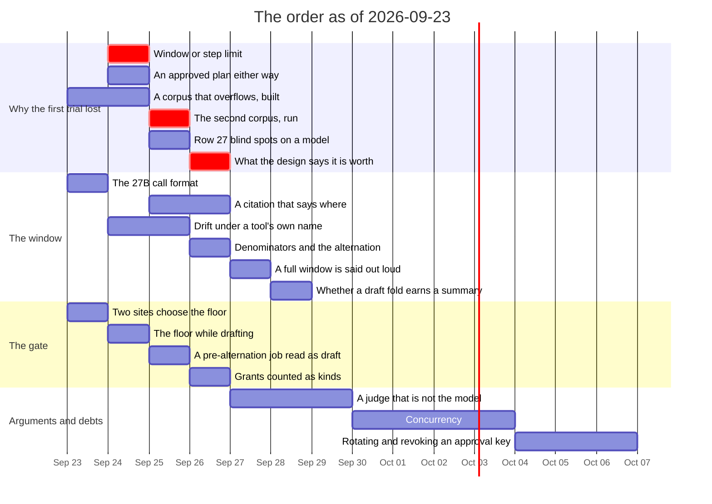

# Roadmap — revision 2026-09-23

**What this is:** the order of work as it stands on this date, and what blocks
what. Not a decision and not a description of the tree — for *what is true today*
read [`luu-design.md`](../../luu-design.md), and for *why* read the dated file
in [`RECORD/`](../../RECORD/) each item links to.

Supersedes [`ROADMAP/2026-09-21`](../2026-09-21/) wholesale. Two days, and the
rows that closed in them are 2, 5 and 27 — plus 31, 32, 33 and 34, which closed
in the commit that cut it — and **11, which had closed before the revision was
written and was carried in error** (see *The late landing*, below). What is
carried is 1, 3, 4, 7, 12, 13, 14, 16, 21, 28, 29, 30 and 35. New rows continue
from 36.

**Numbers are carried, not reassigned**, for the reason the last two revisions
gave: [`luu-design.md`](../../luu-design.md) names item 12 by number, and a
number that moves between revisions is a link that lies. Carried rows are
compressed to their claim and their link.

**The calibration finding: the orders ran, and the first answer was no.** The
last revision's failure had a shape — *orders nobody can run*, four claims
queued behind boxes nobody had a hand on. Two days later the queue is empty.
Machine 3 ran fifteen arms against `qwen3.8-27b` on 2026-09-22–23 and closed
item 2, item 5 and all three of row 27's claims. What fixed the lag was a box
at hand, not a schedule.

The answer is the part to read. **Item 2 was the differentiator's first trial,
and the differentiator lost it.** On `long-session.txt`, the one corpus here
that fills 8K, every 8K arm answers 1 of 6 turns and 96K answers 4 of 6. That
holds with rules A, B and C on together and with each rule alone. Rule A never
fires (nothing the corpus attaches is a span). Rule C turns evictions into
prunes, and the model re-reads `context.rs` 26–27 times against 19. One seed,
one corpus, one box — [`8k-against-96k-on-the-m4-pro`](../../RECORD/2026-09-22.8k-against-96k-on-the-m4-pro.completed.md)
declined to rewrite the design on that alone, and was right to. **This revision
is ordered around finding out *why* before building anything that assumes an
answer.** Rows 36–41 are that, and row 41 is the decision they owe
[`luu-design.md`](../../luu-design.md) §Goals.

**The late landing.** Two commits authored on 2026-09-15 landed at 20:23 and
20:24 on 2026-09-21, two hours after the last revision was cut. One of them
measured item 11 and struck the row in
[`ROADMAP/2026-09-09`](../2026-09-09/README.md), the revision it had been
written against. That is why 2026-09-17 and 2026-09-21 both carried the item
open. Both are struck now, in place. The other commit closed item 6 **a second
time**: [`the-panel-reads-pruned`](../../RECORD/2026-09-15.the-panel-reads-pruned.completed.md)
on a branch and
[`the-panel-reads-the-pruned-lines`](../../RECORD/2026-09-16.the-panel-reads-the-pruned-lines.completed.md)
on `main`, a day apart, one row, two records. The reload bug the branch
deferred to a row of its own had already been fixed by the `main` one. The cut
that missed them read records *written since* the last revision, by filename;
a record dated the 15th that lands on the 21st is invisible to that. So **this
revision was harvested by landing, not by filename** — see
[`state-of-play`](../../RECORD/2026-09-23.state-of-play.completed.md).

## What landed since 2026-09-21

| | |
| --- | --- |
| **8K against 96K, one flag apart** (item 2) | Closed on machine 3, not machine 4. `grounded.txt` never fills 8K and ties by construction; `long-session.txt` does, and 96K answers 4 of 6 against 1 of 6 for plain 8K, rule A alone, `--prune-behind` alone, rule C alone, and all three — [`8k-against-96k-on-the-m4-pro`](../../RECORD/2026-09-22.8k-against-96k-on-the-m4-pro.completed.md) |
| **Whether a model minds losing tool output** (item 5) | Inconclusive. `cited-reads` spares `run_command` and `cited` does not, as built; answers stay 1 of 6 under all three because this corpus's commands are empty greps — [`what-rule-c-is-worth-with-a-model`](../../RECORD/2026-09-22.what-rule-c-is-worth-with-a-model.completed.md) |
| **What this week's instruments owe a model** (row 27) | (a) and (b): every requested edit made, `diverged` 0, every re-asked value current. (c) needed `[authority]` built first; told it is drafting, the model proposes a plan on its first read, 517 tokens against 2 824 and two denied writes — [`edit-reread-on-a-model`](../../RECORD/2026-09-22.edit-reread-on-a-model.completed.md), [`an-authority-a-model-is-told`](../../RECORD/2026-09-22.an-authority-a-model-is-told.completed.md) |
| **What a container start costs** (item 11) | ~100 ms over a host session on machine 1, warm. Measured 2026-09-15, landed 2026-09-21, after the cut — [`what-a-container-start-costs`](../../RECORD/2026-09-15.what-a-container-start-costs.completed.md) |
| **A reload remembers eviction** | No row ordered it; found beside item 6 and already fixed on `main` by the time it landed — [`a-reload-remembers-eviction`](../../RECORD/2026-09-15.a-reload-remembers-eviction.completed.md) |

## The order

**Section A — the runs, and why the first one lost.** Rows 36–41 are new and
all of them are machine 3's. It is the one box that has held the 27B at
`-c 98304`, and every one of them is a comparison against that run. **Every run
in this section is on a server started with one slot** (`-np 1`):
[`8k-against-96k-on-the-m4-pro`](../../RECORD/2026-09-22.8k-against-96k-on-the-m4-pro.completed.md)
§third section found five `--temperature 0 --seed 1` arms that were not
bit-identical at turn 1, because a four-slot server reuses prefixes across
whatever else ran in a slot. *One flag apart* is the discipline this project
measures by, and a four-slot server varies a second thing without anyone
passing a flag. Rows 1, 3, 4 and 35 are carried unchanged and still wait on a
hand on their box.

| # | Item | Blocked on | Argued in |
| --- | --- | --- | --- |
| 36 | **Is the gap the window or the step limit?** 5 of 6 turns in both 8K arms end at `tool limit reached`, and `DEFAULT_MAX_STEPS` is 8. Same corpus, `--max-tool-steps 16`, at 8192 and at 98304. If 8K climbs off 1 of 6, the gap was an explorer being stopped, not a window being too small; if both climb, the limit was taxing both arms. **First, because every other row in this section reads differently depending on the answer** | machine 3 | [`8k-against-96k-on-the-m4-pro`](../../RECORD/2026-09-22.8k-against-96k-on-the-m4-pro.completed.md) §Still open, both *8-step limit* bullets |
| 37 | **A citation that says where the bytes went** — rule C's citation replaces a `read_file` result with a fact, and the model answers by re-reading the whole file. A pointer (path and range) might let it re-read one range. Building it is checkout work; **it is ordered behind 36 on purpose**, because if the gap is the step limit, a cheaper re-read is the fix, and if it is the window, this is the next thing to try — and building it first is the habit the last revision named | row 36, then a record | [`8k-against-96k-on-the-m4-pro`](../../RECORD/2026-09-22.8k-against-96k-on-the-m4-pro.completed.md) §Still open, added; [`the-newest-body-wins`](../../RECORD/2026-09-20.the-newest-body-wins.completed.md) §Still open |
| 38 | **A second corpus that overflows 8K, and is not one file read on repeat.** Three open threads want the same file: (a) item 2's answer is one corpus; (b) item 5's real case — a command whose *result* matters, a failing test or an exit code `closes_on` reads — is what rules B and C's defaults wait on; (c) the mixed corpus, tool output that varies in size and kind, named on the mock on 2026-09-14 and again on a model. One row, the way row 27 was one row: one corpus, one afternoon | building: nothing; running: machine 3 | [`8k-against-96k-on-the-m4-pro`](../../RECORD/2026-09-22.8k-against-96k-on-the-m4-pro.completed.md), [`what-rule-c-is-worth-with-a-model`](../../RECORD/2026-09-22.what-rule-c-is-worth-with-a-model.completed.md), [`what-rule-c-is-worth`](../../RECORD/2026-09-14.what-rule-c-is-worth.completed.md) §Still open |
| 39 | **Whether an approved plan lands the fix either way** — row 27(c) measured what a refusal costs and never sent `ApprovePlan`, so both arms stop with the bug unfixed. Also owed there: `position = "prompt"`, a second seed, and a task that needs more than one read | machine 3 | [`an-authority-a-model-is-told`](../../RECORD/2026-09-22.an-authority-a-model-is-told.completed.md) §Still open, narrowed |
| 40 | **Row 27's two blind spots, on a model** — `banner.rs` is not re-grounded after its edit, and `tally.rs`'s overlapping ranges count as two paths. Both argued and reproduced on the mock; neither has been put in front of a model | machine 3 | [`edit-reread-on-a-model`](../../RECORD/2026-09-22.edit-reread-on-a-model.completed.md) §Still open |
| 41 | **What the design says the differentiator is worth.** §Goals calls optimizing the window *the key differentiator*, and its first trial lost it. The record declined to rewrite the design on one corpus; this row is that deferred decision with its preconditions named. Once 36 and 38 are in, §Goals either gets a sentence saying what was measured or gets a new argument. **Not a run: a decision that must not be deferred a second time** | rows 36 and 38 | [`8k-against-96k-on-the-m4-pro`](../../RECORD/2026-09-22.8k-against-96k-on-the-m4-pro.completed.md) §Still open, last bullet; [`local-first`](../../RECORD/2026-09-01.local-first.completed.md) |
| 1 | **The BC-250's heap is a setting** — `amdgpu.gttsize=12288`, a reboot, and whether `ggml-vulkan` uses the heap it is given | machine 6, and a reboot | [`the-16gb-threshold`](../../RECORD/2026-09-16.the-16gb-threshold.WIP.md) §1–2 |
| 35 | **The 27B's RTX fit test** — does `Qwen3.8-27B-GSQ-RCO-IQ3_S.gguf` load and hold a turn on 16 GB of VRAM | machine 4 | [`the-16gb-threshold`](../../RECORD/2026-09-16.the-16gb-threshold.WIP.md) §3 |
| 3 | **A model inside a container** — every contained run here is the mock. **Carried unchanged for a fourth revision** | machine 4 | [`a-session-picks-its-executor`](../../RECORD/2026-09-08.a-session-picks-its-executor.completed.md) §Still open |
| 4 | **Machine 2 earns its first question** — a Metal control for RADV's doubt, and the bandwidth floor | machine 2 | [`the-16gb-threshold`](../../RECORD/2026-09-16.the-16gb-threshold.WIP.md) §6–7 |

**Section B — the window.** Rule A is on and B and C are off, and item 2 made
both facts look different. Rule A has now been measured inert on the one
corpus that overflows, because that corpus attaches no spans. B and C stay off
because nothing has shown they help a model — row 38 is the corpus that could.
One new row, next to item 7, because it is the same kind of thing.

| # | Item | Blocked on | Argued in |
| --- | --- | --- | --- |
| 42 | **The 27B's tool-call format works by a fallback, not by design** — it emits `<tool_call>{…}</tool_call>` and leaks a `</think>` where the preamble asks for a fenced ` ```tool ` block. `luu` ran the calls because `parse_call` accepts a bare JSON object, a fallback written for a 7B that drops the fence. Every row in Section A runs this model. **How often it happens is not on disk**: the evidence files under `RECORD/runs/2026-09-22.*` keep `luu`'s rendering of each call and not the raw reply, and none of them contains either tag | nothing | [`8k-against-96k-on-the-m4-pro`](../../RECORD/2026-09-22.8k-against-96k-on-the-m4-pro.completed.md) §Still open; [`a-grammar-for-tool-calls`](../../RECORD/2026-09-06.a-grammar-for-tool-calls.completed.md) |
| 7 | **Drift under a tool's own name** — `` ```list_dir ``, `` ```run_command ``; wants `avoid_until_forced` once per tool name | nothing | [`what-constrain-does`](../../RECORD/2026-09-14.what-constrain-does.completed.md) §Still open |
| 29 | **The tally has no denominator and no opinion** — `repeated` counts what rule A dropped and nothing counts what it did not, and a count per session is not a count across sessions. **Widened by two counts one surface along**, both the same arithmetic: how many drafts end in an approval against how many are folded (`ClosedBy::Approval` made that countable on 2026-09-21), and how often the floor refuses anything | nothing | [`one-counting-surface`](../../RECORD/2026-09-19.one-counting-surface.completed.md), [`the-alternation-on-the-page`](../../RECORD/2026-09-21.the-alternation-on-the-page.completed.md), [`what-an-unapproved-turn-may-reach`](../../RECORD/2026-09-21.what-an-unapproved-turn-may-reach.completed.md) §Still open |
| 21 | **A window that no longer fits is absorbed in silence** — make it visible, not configurable | needs a design argument | [`the-window-rules-are-a-session-fact`](../../RECORD/2026-09-18.the-window-rules-are-a-session-fact.completed.md) §6th |
| 30 | **Whether a draft's fold is worth its summary** — nothing says where the floor is | needs a design argument | [`every-turn-belongs-to-a-job`](../../RECORD/2026-09-20.every-turn-belongs-to-a-job.completed.md) §Still open |
| 28 | **The two keys by content, and the migration they cost** — owed the moment rule A reaches a tool's result. Ordered, not scheduled | rule A reaching more than spans | [`the-window-rules-are-a-session-fact`](../../RECORD/2026-09-18.the-window-rules-are-a-session-fact.completed.md) §sixth, §eleventh |

**Section C — the gate, and the surfaces that show it.** Three new rows, all
from records that landed in the last revision's own commit and were never
harvested. The first may be a sandbox defect rather than a surface one, which
is why it leads.

| # | Item | Blocked on | Argued in |
| --- | --- | --- | --- |
| 43 | **The two sites that choose the floor decide differently** — `begin_turn` trusts `session.narrowed` alone; `start_turn` checks it against the live job. Both mean *the plan when there is one*, and the first would not notice a narrowing left behind by a job that is no longer live. Not shown reachable yet; the next move is a test that tries | nothing | [`what-an-unapproved-turn-may-reach`](../../RECORD/2026-09-21.what-an-unapproved-turn-may-reach.completed.md) §1, §Still open after building it |
| 44 | **The floor is shown only at the gate** — most drafting turns run with no gate up, and nothing on the page says what they may reach while they run. Named twice in the record that put the floor at the gate | nothing | [`what-an-unapproved-turn-may-reach`](../../RECORD/2026-09-21.what-an-unapproved-turn-may-reach.completed.md) §Still open |
| 45 | **A pre-alternation recording reads an approved job as a draft** — the `!plan` rule, now on two surfaces. It is a rule about what a `null` means, and the honest fix is the kind `RESTORED_DRAFT` already is | nothing | [`the-alternation-on-the-page`](../../RECORD/2026-09-21.the-alternation-on-the-page.completed.md) §Still open |
| 12 | **Grants are counted as path strings and not as kinds** — the field that closes it is written at approval, where `is_dir()` is known | the field | [`the-surfaces-first`](../../RECORD/2026-09-08.the-surfaces-first.completed.md), narrowed in [`one-counting-surface`](../../RECORD/2026-09-19.one-counting-surface.completed.md) |

**Section D — wants an argument before it wants a commit.** Unchanged.

| # | Item | Blocked on | Argued in |
| --- | --- | --- | --- |
| 13 | **A judge that is not the model under test** | needs a design argument | [`machines.md`](machines.md) P1 |
| 14 | **Concurrency** — `serve` runs one live session at a time | needs a design argument | [`state-of-play`](../../RECORD/2026-09-09.state-of-play.completed.md) §Still open |
| 16 | **Rotating and revoking an approval key**, and nothing signs a *recording* | waits on a fleet being more than the boxes in one room | [`signed-approvals`](../../RECORD/2026-09-04.signed-approvals.completed.md) §Still open |



Rows 1, 3, 4 and 35 are not on the chart. They have been carried for three
revisions behind a hand on a box, and a bar with a date on it would be a
promise nobody has made. Row 28 is not on it either: it is ordered and
deliberately unscheduled.

## What actually blocks what

- **Row 36 blocks the reading of everything else in Section A.** If a higher
  step limit lifts the 8K arm, the gap is about a model that explores until it
  is stopped. Then row 37's pointer is an efficiency, row 38 has to be written
  so its questions are answerable in few reads, and row 41's sentence is about
  the step budget, not the window. If it does not, the window is the gap, and
  37 is the first attempt at closing it. Either way, the row is one flag on a
  corpus and a server that already exist.
- **Row 37 is the instrument this revision is most tempted to build first**,
  because it is checkout work and the run it depends on is not. That is the
  habit [`one-counting-surface`](../../RECORD/2026-09-19.one-counting-surface.completed.md)
  named and the last revision priced — three times in one week an instrument
  arrived ahead of the run that gave it meaning. It sits behind 36 so that the
  order enforces what the last revision could only say.
- **Row 38 can be built now and should be.** A corpus is not an instrument
  looking for a meaning. It is the run's precondition, and three rows already
  say what it must contain. The last corpus built this way
  ([`a-corpus-that-edits`](../../RECORD/2026-09-19.a-corpus-that-edits.completed.md))
  became row 27's evidence three days later.
- **Row 41 is new in kind.** Every earlier row owed the design a *fact*; this
  one owes it a *sentence about what the project is for*, and it has a
  deadline made of two runs rather than a date. The failure it guards against
  is an old one here: a result nobody likes becoming an open question forever.
- **Rows 39 and 40 do not depend on 36** and share machine 3 with it. They are
  the afternoon's second half, not its first.
- **Row 43 leads Section C because it may be a sandbox bug.** Every other row in
  the section is about what a person is shown; this one is about what a turn
  may do, and it should be settled before anyone draws the floor on the page
  (row 44).
- **Row 29 grew instead of splitting.** The alternation's counts and the
  floor's refusals are the same arithmetic on the same surface. Three rows
  for one `api::Counts` change would be how row 25 was written five times
  before anyone ordered it.
- **Nothing in Section D blocks anything in A, B or C** — fifth revision
  running.
